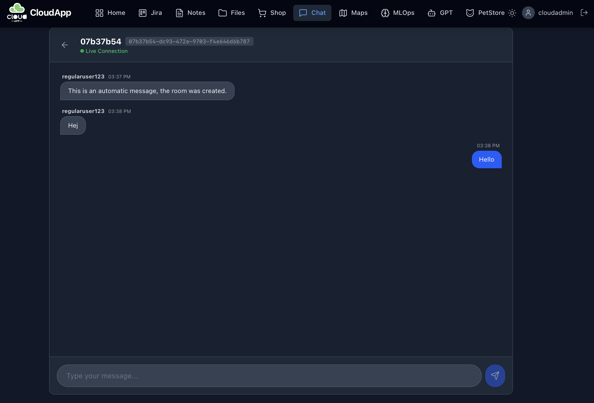
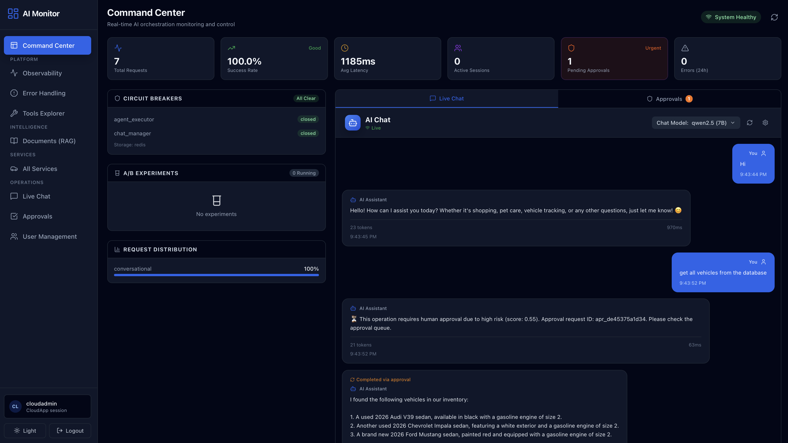

# Web Development and Predictive Analytics Portfolio
<p align="center">
  
</p>

Welcome to my dynamic portfolio, showcasing cutting-edge projects from my [Web Development](https://graduation.udacity.com/confirm/QDDKHJF9), [RAG and Agentic AI](https://www.coursera.org/account/accomplishments/specialization/JMUHR8ZOHOOE?utm_source=link&utm_medium=certificate&utm_content=cert_image&utm_campaign=sharing_cta&utm_product=prof) and [Predictive Analytics for Business](https://confirm.udacity.com/e/3ac984b2-6128-11ee-a6fe-9be76f9bc811) Nanodegrees. This repository is packed with full-stack solutions, ranging from microservices to interactive front-end interfaces, llm and agentic solutions and robust data analytics models.

## What's Inside?

- **CloudApp - Interactive Next.js 15 (React 19) App Shell and Micro Frontend**: Experience the sleek interface designed to interact seamlessly with the backend services.  [Explore the frontend](./frontend/cloudapp-shell/README.md).
    - A micro frontend setup with an app shell solution to enable independently deployable front-end modules, improving scalability and maintainability. [Check details](#4-maps-with-vehicle-locations)
- **Microservices Architecture**: Dive into backend API services crafted during my Nanodegree. More about backend services: [cloudapp](./backend/cloudapp/README.md), [petstore](./backend/petstore/README.md), [vehicles-api](./backend/vehicles-api/README.md), [jira-proxy](./backend/web-proxy/README.md).
- **NGINX Gateway with Session/Auth Enforcement**: sole ingress point with CloudApp auth subrequests, admin-only protection for `/cloudapp-admin/*` and `/ai/system/*`, authenticated access for `/ai/*` and `/ai/ws/*`, rate limiting (auth 5r/s, API 30r/s, AI 60r/s), TLS 1.2/1.3, WebSocket proxying, and OTel header propagation. [See config](./frontend/nginx/conf/nginx.conf).
- **Advanced ML Pipeline**: Leverage my Python-based machine learning pipeline for dynamic customer segmentation, developed during my Predictive Analytics Nanodegree. [See ML details](./backend/ml-pipeline/README.md).
- **Locally hosted LLM with Ollama**: Deploy and interact with a locally hosted LLM using Ollama, featuring a configurable model setup. In this case, Qwen3 was used to provide AI-driven insights while maintaining full control over data privacy and performance. [Details on LLM integration](#5-private-local-llm-ai)
- **Jira with local LLM refinement**: create Jira tickets and refine them with locally hosted LLM. [Details on API integration](#6-jira-with-ai-refinement).
- **Real-Time Chat**: Engage with the Kafka-powered chat application with Confluent Kafka, WebSocket bridge, and MongoDB persistence. [Chat interface](#8-chat).
- **AI Orchestration Layer**: FastAPI-based orchestration with LangGraph agentic workflows, RAG pipeline (ChromaDB), A/B testing, Human-in-the-Loop approval, circuit breakers, and WebSocket streaming. [Details on AI orchestration](#9-ai-orchestration-layer).
- **AI Orchestration Monitor**: React/Vite admin dashboard for observability, RAG management, HITL approvals, error tracking, and real-time streaming visualization, reusing the CloudApp admin session via gateway-protected routes. [Monitor details](#10-admin-ai-orchestration-monitor).
- **Observability Stack**: Distributed tracing (Jaeger), metrics (Prometheus), dashboards (Grafana), and OpenTelemetry auto-instrumentation across all services. [Observability details](#observability).
- **Security Architecture**: RSA-signed JWT sessions, HttpOnly cookie auth for browser clients, CSRF protection, role-based access control, service-to-service auth, and non-root Docker containers. [Security details](#security).
- **Resilience Patterns**: Resilience4j circuit breakers on external API calls with graceful fallbacks, health indicators, and Prometheus metrics. [Resilience details](#resilience).
- **API Contract Governance**: OpenAPI snapshot drift detection, TypeScript client generation, and NGINX-level API versioning (`/v1/` prefix). [Contract details](#api-contract-governance).
- **CI/CD with GitHub Actions**: 6-stage parallel CI pipeline (backend, ML, NGINX, API contracts, frontend, Playwright E2E) plus nightly AI integration tests. [See workflows](./.github/workflows/).

Example view:


## Quick Start

### Setup with Docker
Note: minimum 16 GB RAM and 35 GB disk space is needed to make sure all services can run.
```bash
brew install docker
brew install docker-compose
```

Step 1. Setup and start databases and essential services with docker-compose:
```bash
docker-compose -f docker-compose-infrastructure.yml up -d
```
Step 2. Install local ollama, for Apple Silicon computers, GPU acceleration is not available via Docker, thus one needs to run it outside of docker:
```bash
brew install ollama
# Get a few thinking AND tools model https://ollama.com/search?c=tools&c=thinking
ollama pull qwen3:1.7b
ollama pull deepseek-r1:1.5b
# Get an embedding model for RAG at ollama.com/search?c=embedding
ollama pull qwen3-embedding:4b
ollama serve
```
<details>
  <summary>Alternative Step 2 (containerized Ollama on CPU, instead of native Ollama on Apple Silicon)</summary>

```bash
docker compose --profile ollama -f docker-compose-infrastructure.yml up -d
```

Note: configure Ollama model to use with NEXT_PUBLIC_LLM_MODEL in docker-compose-infrastructure.yml, in this example it was qwen3 with 1.7B parameter, good enough for local testing purposes.
```dockerfile
  ollama:
    container_name: ollama
    build:
      context: ./
      dockerfile: Dockerfile_OLLAMA
      args:
        NEXT_PUBLIC_LLM_MODEL: 'qwen3:1.7b'
    ports:
      - 11434:11434
```
</details>

Step 3. Build and start the app stack:
```bash
docker-compose -f docker-compose-app.yml up -d
```

Step 4. Runs the app in the production mode.
Open http://localhost:5001 to view it in your browser. For development mode check [instructions here](./frontend/cloudapp-shell/README.md#option-2-dev-mode).

If everything is correctly started, you should see a login page with optional Dark Mode:
You can login with the following test users
```text
user: cloudadmin pwd: cloudy

user: regularuser123 pwd: 456789
```


And you should be able to register and log in, and see the current front-end of the api integrations from the services above:


## 1. Machine learning system for Customer Segmentation

MLOps interface for [Customer Segmentation API](backend/ml-pipeline/README.md), the user is able to auto trigger the whole customer segmentation process and generate the latest segmentation plots with these options:
- Add new customer data point to the database.
- Sample reference database with predefined 10-20-50-100-200 amount of samples.  


View results:
- Graphs: correlation between parameters and the different segments.
- Table: current list of customers from postgres db.

The module is built as Micro Frontend:  
CloudApp-Shell as App Shell using the MLOps micro frontend:  
http://localhost:5001/mlops


## 2. Shop interface for [Cloudapp web store REST API](backend/cloudapp/README.md), 

The user is able to:
- Create new items (admin only).
- Add existing items to the cart.
- See and clear the cart.
- Submit cart and check order history.  

Shop API documentation: 
- [Items](http://localhost:80/cloudapp/swagger-ui/index.html#/item-controller)
- [Cart](http://localhost:80/cloudapp/swagger-ui/index.html#/cart-controller)
- [Order](http://localhost:80/cloudapp/swagger-ui/index.html#/order-controller)

## 3. Pet Store interface for the [Pet Store's REST API](backend/petstore/README.md)
The module is built as Micro Frontend:  
CloudApp-Shell as App Shell using the Petstore micro frontend:  
http://localhost:5001/petstore


The user is able to:
- Add new customer.
- Add a new Pet to existing customers.
- Add new employees with skills and schedules.
- Check availability based on skills and schedules.
- Plan a new schedule for an employee and assign it to a pet.


## 4.  Maps with vehicle locations
The module is built as Micro Frontend:  
CloudApp-Shell as App Shell using the Maps micro frontend:  
http://localhost:5001/maps


Map interface for integrating Open Street Map with the [Vehicle location service's REST API](backend/vehicles-api/README.md).
The user is able to:
- Click on the map to add new vehicle locations.
- Click on existing locations and check basic info and delete the location.  

Vehicles [API documentation](http://localhost:8880/vehicles/swagger-ui.html)

## 5. Private Local LLM AI
Chat  interface for communicating with
a locally hosted Ollama Qwen3 model, the user is able to:
- Chat with a local LLM (and see model reasoning process, in models where it is applicable - can be toggled)

The module is built as Micro Frontend:
CloudApp-Shell as App Shell using the Local LLM AI micro frontend:  
   http://localhost:5001/chatllm


3. Optionally one can also use command line:
```bash
curl http://localhost:11434/api/generate -d '{                              
  "model": "qwen3:1.7b",
  "prompt": "Why is the sky blue?"
}'
```


## 6. Jira with AI refinement
Jira interface for communicating with
the [Jira API](https://developer.atlassian.com/cloud/jira/platform/rest/v3/intro/), to use it:
- [Register](https://www.atlassian.com/software/jira/free)
- [Create Personal Access Token](https://confluence.atlassian.com/enterprise/using-personal-access-tokens-1026032365.html)
- [Use it for requests](https://developer.atlassian.com/cloud/jira/platform/basic-auth-for-rest-apis/)

The user is able to:

- Create/list/update/delete Jira ticket
- Refine and edit tickets with LLM
- Create and edit children tickets proposal with LLM

CloudApp-Shell as App Shell using the Jira micro frontend:  
   http://localhost:5001/jira


## 7. Notes and Files
A service for creating personal notes and uploading personal files.


- Notes [API documentation](http://localhost:80/cloudapp/swagger-ui/index.html#/note-controller)
- Files [API documentation](http://localhost:80/cloudapp/swagger-ui/index.html#/file-controller)
## 8. Chat
A Kafka based chat service, the user is able to:

- Create new chat rooms, furthermore share and enter chat room id  


- Talk to other users in chat rooms  



## 9. AI Orchestration Layer
A FastAPI-based AI orchestration layer (`ai-orchestration/ai-orchestration-layer/`) providing:

**LangGraph Agentic Workflow**
- Multi-node graph: `initialize` → `classify_intent` → `route_to_capability` → capability nodes → `finalize`
- Capability routing: conversational, multi-agent (shop/petstore/vehicle agents), workflow execution, ML pipeline, RAG query
- SQLite-backed checkpointing with thread-based state recovery and MemorySaver fallback

**RAG Pipeline (Retrieval-Augmented Generation)**
- Async document upload with progress tracking (PDF, DOCX, TXT, MD, CSV — 10MB limit)
- ChromaDB vector database with similarity search (configurable top-k, 1-20)
- LLM-based answer generation with source attribution and confidence scores

**A/B Testing Framework**
- Full experiment lifecycle: DRAFT → RUNNING → PAUSED → COMPLETED
- Deterministic variant assignment (MD5 hash), metrics tracking (impressions, conversions, latency, error rates)
- Z-test statistical significance analysis, MongoDB storage with in-memory fallback

**Human-in-the-Loop (HITL)**
- Risk-based hybrid approach: auto-approve, flag, or require manual approval based on risk score
- Approval types: FINANCIAL, ML_DECISION, DATA_ACCESS, WORKFLOW_BRANCH, AGENT_ACTION, EXTERNAL_API, CONTENT_GENERATION
- WebSocket real-time notifications, TTL-based expiration, Redis storage with in-memory fallback

**Circuit Breaker & Resilience**
- Redis-backed distributed circuit breaking (CLOSED → OPEN → HALF_OPEN)
- Graceful degradation across all components: SQLite → MemorySaver, Redis → in-memory, MongoDB → in-memory, streaming → full response

**WebSocket Streaming**
- Real-time token streaming during LLM generation with node progress events
- HITL approval integration within streaming context

**Operational API Surface (behind `/ai`)**
- Gateway-protected with authenticated CloudApp identity; `/ai/system/*` is admin-only
- `/orchestrate` — orchestration execution and workflow routing
- `/rag/*` — document upload/query/management endpoints
- `/approvals/*` — Human-in-the-Loop approval queue and actions
- `/experiments/*` — A/B testing lifecycle and metrics
- `/tools/*` — tool discovery and invocation
- `/llm/*` — model discovery/selection endpoints for chat/rag/embedding
- `/metrics`, `/health`, `/config` — operational visibility and diagnostics
- `/conversation-sync/*` — cross-session conversation synchronization (Redis-backed when available)

## 10. Admin-AI Orchestration Monitor


A React/Vite admin dashboard (`ai-orchestration/ai-orchestration-monitor/`) at http://localhost:5010 providing:
- **Streaming Interface** — real-time token/response visualization
- **Observability Dashboard** — metrics, traces, latency charts
- **RAG Dashboard** — document upload, query interface, document management
- **Approval Interface** — HITL approval queue with approve/reject workflow
- **Tools Explorer** — tool discovery and invocation testing
- **Error Dashboard** — error tracking and analysis
- **Services Dashboard** — service health monitoring
- **Model Selector** — dynamic LLM model switching
- **Unified Dashboard** — consolidated operator view across monitor capabilities
- **Conversation Sync UI hooks** — multi-session/state synchronization support for orchestration workflows
- **User Management** — Promoting existing users to Admin role

Authentication model:
- Uses the same CloudApp login/session as the main app
- Browser clients authenticate with the `CLOUDAPP_AUTH` HttpOnly cookie
- Admin monitor routes are enforced through `/cloudapp-admin/*` and admin-only `/ai/system/*` gateway checks

---

# Architecture

## Observability
Distributed observability across all services:

- **Jaeger v2** — distributed tracing via OTLP gRPC/HTTP (http://localhost:16686)
- **Prometheus** — metrics collection with 15s scrape interval, 7-day retention (http://localhost:9090)
- **Grafana** — dashboards and visualization (http://localhost:3000)
- **OpenTelemetry** — Java Agent v2.25.0 auto-instrumentation on all Spring Boot services, manual instrumentation on Python services
- **Request ID correlation** — X-Request-ID, traceparent, tracestate propagated through NGINX to all upstreams
- **Spring Actuator** — health, info, and Prometheus endpoints exposed per service

## Security
- **JWT session authentication** — RSA asymmetric keys (PEM files), with browser clients authenticated primarily via the `CLOUDAPP_AUTH` HttpOnly cookie and validated through `/user/auth-check`
- **CSRF protection** — CookieCsrfTokenRepository with SameSite=Lax
- **Role-based access** — ADMIN/USER roles with method-level Spring Security authorization
- **Service-to-service auth** — `X-Internal-Auth` token for internal requests
- **NGINX as sole ingress** — backend services expose zero host ports
- **Rate limiting** — auth endpoints (5 req/s), API general (30 req/s), AI endpoints (60 req/s)
- **TLS 1.2/1.3** — modern ECDHE cipher suites
- **Non-root containers** — non-root runtimes are used for the Next.js frontends and AI orchestration services

## Resilience
- **Resilience4j** circuit breakers on vehicles-api external calls (Maps, Pricing APIs)
  - 50% failure threshold, 30s recovery window, COUNT_BASED sliding window (size 5)
  - Graceful fallbacks, health indicators, and Prometheus metrics per breaker
- **AI Layer** — Redis-backed distributed circuit breaking for tool invocations and external API calls

## API Contract Governance
- **OpenAPI snapshot export** from live services (`scripts/contracts/openapi_contracts.py`)
- **Contract drift detection** — compares current specs against committed snapshots in CI
- **TypeScript client generation** — typed operation clients for frontend consumers
- **API versioning** — `/v1/` prefix rewrite at NGINX gateway layer

Typical local usage (when services are running):
```bash
python3 scripts/contracts/openapi_contracts.py export
python3 scripts/contracts/openapi_contracts.py check --check-generated
```

Generated TypeScript operation clients are written to:
- `frontend/cloudapp-shell/src/generated/contracts/`

## Database Landscape

| Database | Technology | Purpose | Port |
|----------|-----------|---------|------|
| postgres | PostgreSQL | CloudApp (users, items, carts, orders) | 5433 |
| postgres-ml | PostgreSQL | ML pipeline (customer segmentation) | 5434 |
| mysql | MySQL 8.0 | Petstore (pets, customers, employees) | 3307 |
| mongo | MongoDB | Kafka chat messages | 27018 |
| mongo-abtest | MongoDB | A/B testing experiments & metrics | 27019 |
| redis | Redis 7 | AI orchestration cache, circuit breakers | 6379 |
| chromadb | ChromaDB | RAG vector embeddings | 8000 |
| H2 | H2 (in-memory) | Vehicles-API (dev only) | — |

## CI/CD
- **GitHub Actions CI** (`ci-tests.yml`) — 6 parallel jobs: backend integration (4 Spring Boot services), ML Pipeline (pytest), NGINX gateway (JWT/routing/CORS), API contract drift detection, frontend unit (Jest + React Testing Library), Playwright E2E
- **Nightly AI integration tests** (`nightly-ai-integrations.yml`) — full stack startup with Ollama, AI E2E tests, 180-minute timeout
- **Artifact uploads** — test results, coverage reports, Playwright reports (7-14 day retention)
- **Concurrency control** — groups by ref, cancels in-progress runs on new pushes

## Local Testing & Verification
- Full local test guide: [TESTING.md](./TESTING.md)
- Docker-based test composition: [`docker-compose.test.yml`](./docker-compose.test.yml)
- Run all suites (backend, ML, AI orchestration layer, contracts, NGINX, frontend unit, Playwright):
```bash
docker compose -f docker-compose.test.yml up --build --abort-on-container-exit test-all
```
- Targeted suites (examples):
```bash
docker compose -f docker-compose.test.yml up --build --abort-on-container-exit test-ai-orchestration-layer
docker compose -f docker-compose.test.yml up --build --abort-on-container-exit test-api-contracts
docker compose -f docker-compose.test.yml up --build --abort-on-container-exit test-e2e
```

---

# Optional API services

If Jira functionality is to be used, follow the instructions below:

## Jira API key, [how to register](https://www.atlassian.com/software/jira/free) and [how to get an API key](https://support.atlassian.com/atlassian-account/docs/manage-api-tokens-for-your-atlassian-account/)

Set these in your root `.env` file:

```bash
JIRA_DOMAIN='https://your-jira-instance.atlassian.net'
JIRA_API_TOKEN='your-api-token'
JIRA_PROJECT_KEY='yourjiraprojectkey'
JIRA_EMAIL='youremail'
```
Only `JIRA_PROJECT_KEY` is exposed to the browser. Credentials stay server-side in `jiraproxy`.
