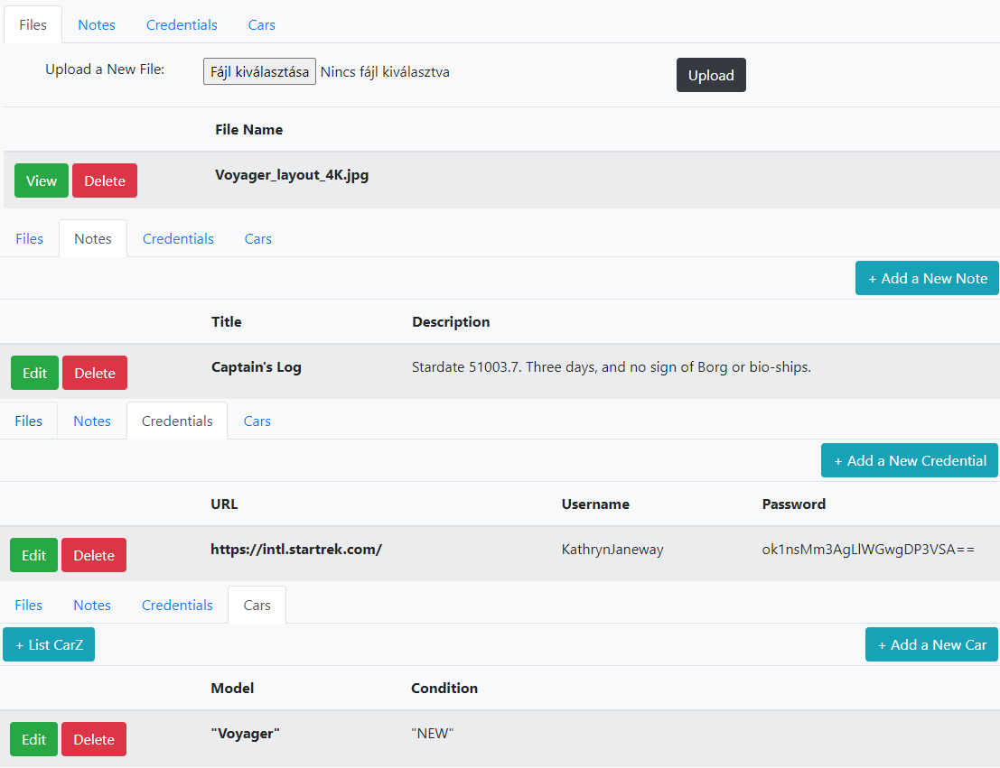

# Java portfolio project

Repository for the different projects from my Nanodegree in [Java Web Development at Udacity](https://www.udacity.com/course/java-developer-nanodegree--nd035), combined to a cloud interface.


## Roadmap
Development roadmap with requirements and milestones.

Three base layers of storage application for Files, Notes and Credentials:

- [x] The cloud service back-end with Spring Boot
- [x] The cloud service front-end with Thymeleaf
- [x] Cloud service application tests with Selenium

Extra layers of cloud interface application:

- [x] Cars interface for the Car service's REST API. For project details see [Vehicles API](vehicles-api/README.md).
- [ ] Scheduling interface for a Pet Store's Saas Application

**Example of user interface**


### The Back-End
Features:

**1. Managing user access with Spring Security**
- Unauthorized users are restricted from accessing pages other than the login and signup pages.
- Custom handling of calls to the `/login` and `/logout` endpoints.
- Custom `AuthenticationProvider` which authorizes user logins by matching their credentials against those stored in the database.

**2. Handling front-end calls with controllers**
- Controllers for the application that bind application data and functionality to the front-end. Using Spring MVC's application model to identify the templates served for different requests and populating the view model with data needed by the template.
- Controllers also be responsible for determining what, if any, error messages the application displays to the user. When a controller processes front-end requests, it delegates the individual steps and logic of those requests to other services in the application, but it interprets the results to ensure a smooth user experience.

**3. Making calls to the database with MyBatis mappers**
- All entity classes match the database schema.sql.
- All entities have a MyBatis mapper interface in the mappers folder. They have methods that represent specific SQL queries and statements required by the functionality of the application. They support the basic CRUD operations for their respective models.


### The Front-End
There are HTML templates for the application pages. They have fields, modal forms, success and error message elements, as well as styling and functional components using Bootstrap as a framework. They also have Thymeleaf attributes to supply the back-end data and functionality described by the following individual page requirements:

**1. Login page**
- All users can access the page and only registered users are able to login to the application.
- Shows login errors, like invalid username/password, on this page.


**2. Sign Up page**
- All users can access the page and potential users can use this page to sign up for a new account.
- Shows signup errors on the page when they arise.
- Password is stored securely with hashing/salt.


**3. Home page**
   The home page is the center of the application and hosts the three parts of base functionality plus the additional extra layers:  

    i. Files
   - The user can upload files and see/download/delete any files they previously uploaded.
   - Any errors related to file actions is displayed (no duplicates or empty/large files).
   
    ii. Notes
   - The user can create notes and see/edit/delete notes they have previously created. Size limit is 1000 character.

    iii. Credentials
   - The user can store credentials for specific websites and see/edit/delete the credentials they've previously stored.
   - Passwords are displayed in encrypted form in the list, but upon editing they are able to see the unencrypted values.

    iv. Cars
   - The user can do basic CRUD operations from the Cars tab, which uses Vehicles service API interface.
   - Any errors related to the operations is displayed.

### Testing
Selenium tests are defined to verify user-facing functionality and to check feature-completeness.

1. Tests for user signup, login, logout and unauthorized access restrictions.
2. Tests for note creation, viewing, editing, and deletion.
3. Tests for credential creation, viewing, password encryption, editing, and deletion.
4. Test for checking empty file upload.

## Dependencies

The project requires the use of Java 11 and Maven.

## Installing instructions

Check each component to see its details and instructions. Note that all applications
should be running (start them in reading order) at once for full operation. Further instructions are available in the classroom.

- [Eureka](eureka): microservice registration and discovery.
- [Boogle Maps](boogle-maps/README.md): a mock service to simulate a backend for vehicle location.
- [Pricing Service](pricing-service/README.md): a mock service to simulate a backend for vehicle pricing.
- [Vehicles API](vehicles-api/README.md): second main project of nanodegree program. A REST API to maintain vehicle data and to provide a complete
  view of vehicle details including price and address.
- [CloudInterface](cloudinterface/README.md): first main project of nanodegree program, extended to communicate with the Vehicles API and send/receive data with it.

1. Compile and package application in each subfolder:
```
   mvn clean package
```
2. Eureka:
```
java -jar target/eureka-0.0.1-SNAPSHOT.jar
```
•	The service is available by default on port 8761. Check interface: http://localhost:8761/
3. Boogle Maps:
```
java -jar target/boogle-maps-0.0.1-SNAPSHOT.jar
```
•	The service is available by default on port 9191. You can check it on the command line by using.
```
curl http://localhost:9191/maps?lat=20.0&lon=30.0
```
4. Pricing Service:
```
java -jar target/pricing-service-0.0.1-SNAPSHOT.jar
```
•	The service is available by default on port 8082. You can check it on the command line by using.
```
curl http://localhost:8082/services/price?vehicleId=1
```
5. Vehicles API:
```
java -jar target/vehicles-api-0.0.1-SNAPSHOT.jar
```
•	Swagger API documentation is available at: http://localhost:8080/swagger-ui.html

6. Cloud interface:
```
java -jar target/cloudinterface-0.0.1-SNAPSHOT.jar
```
•	The service is available by default on port 8081. Check interface: http://localhost:8081/


