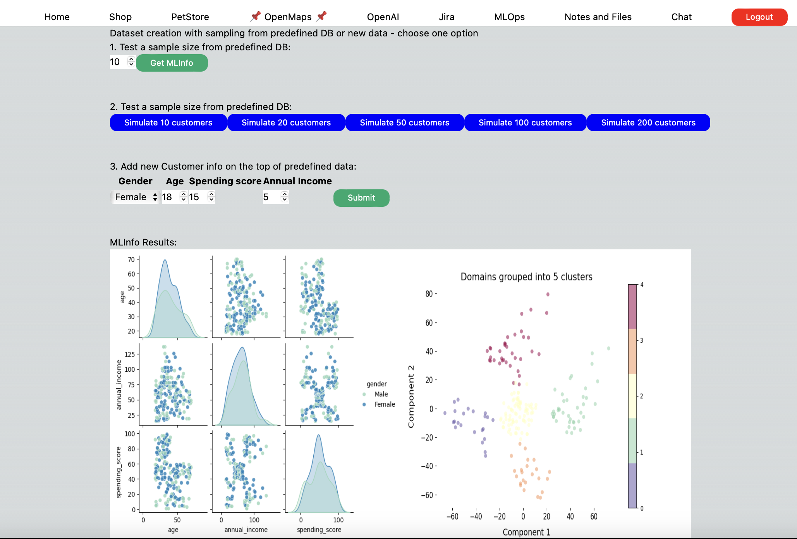
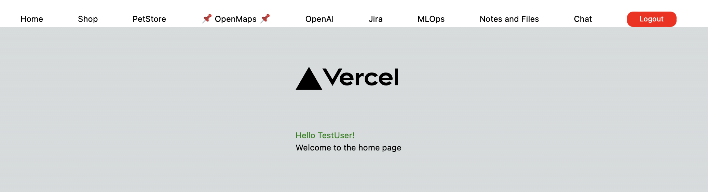
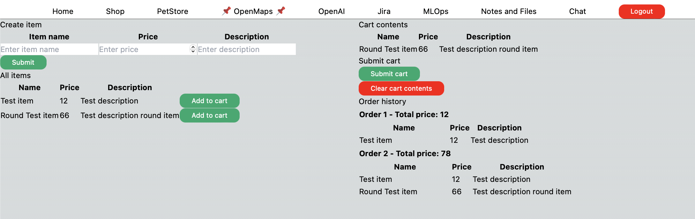
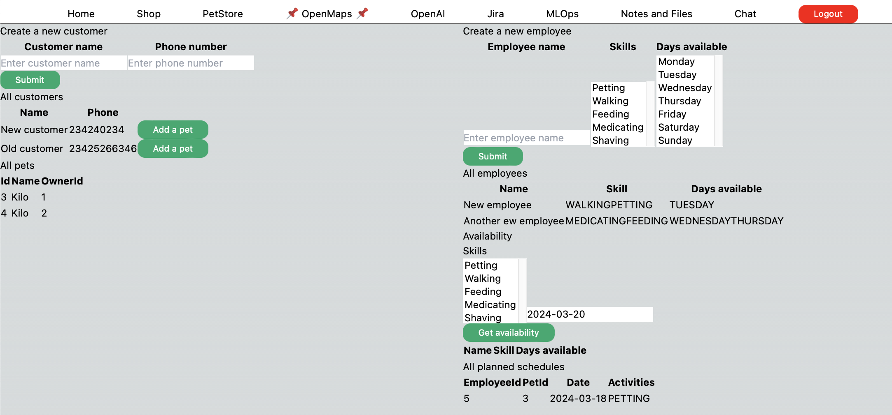
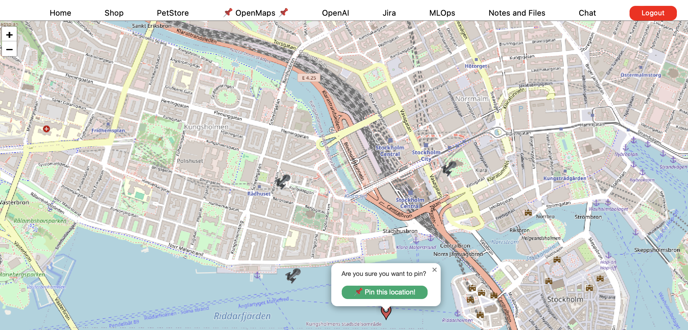
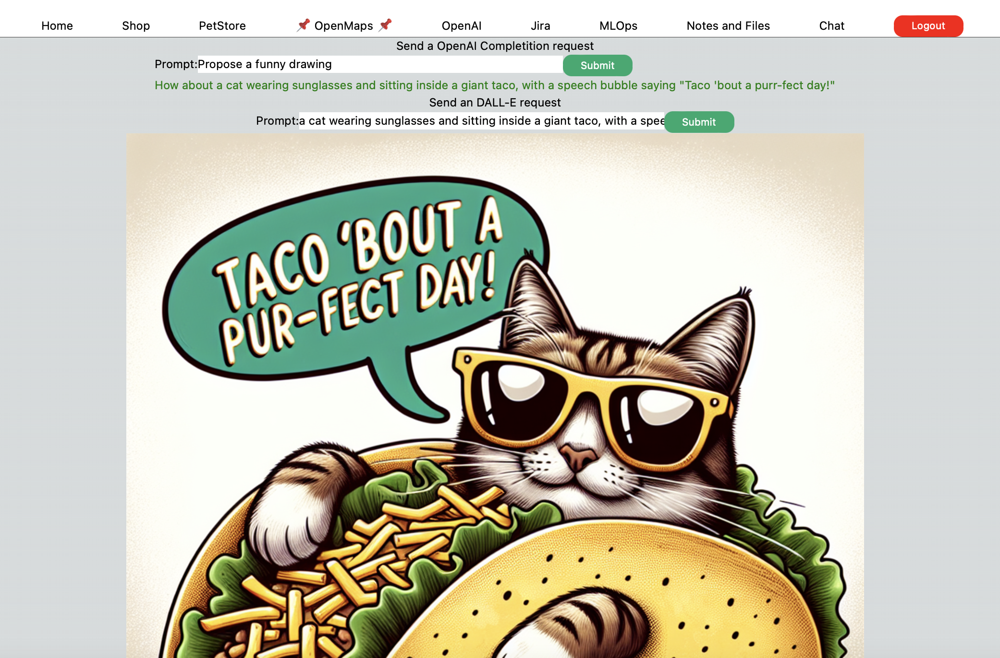
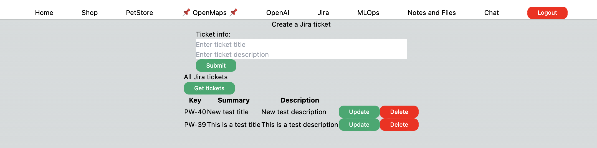
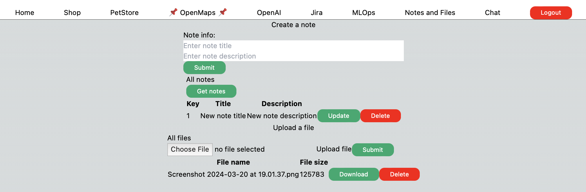
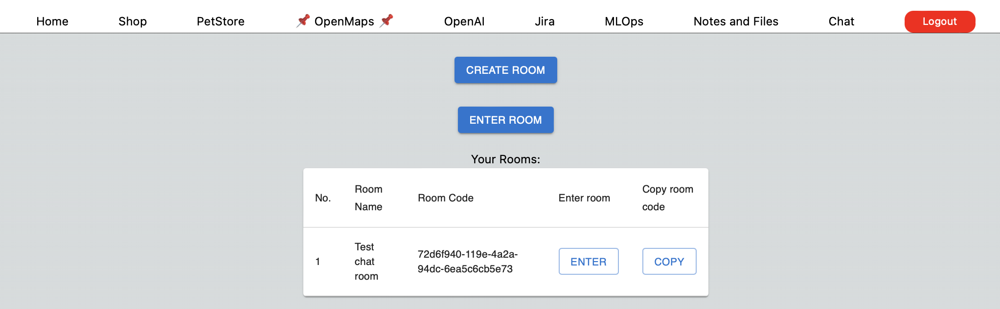
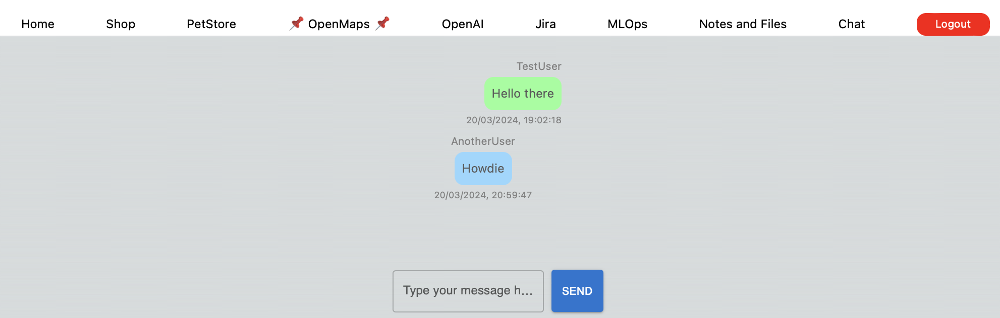

# Web development portfolio

This is a collection of my development projects from Web Development and Predictive Analytics Nanodegrees:
- Back-end [API services](#required-api-services) developed by me during my Nanodegree [Web Development at Udacity](https://www.udacity.com/course/java-developer-nanodegree--nd035).
- Next.js 14 front-end [interface](#react-front-end) for utilizing these back-end services from above and new services below.
- ML pipeline for [Dynamic Customer Segmentation](#1-machine-learning-system-for-customer-segmentation), building on my Nanodegree in [Predictive Analytics for Business](https://www.udacity.com/course/predictive-analytics-for-business-nanodegree--nd008t)
- External api service integration, such as:
  - [OpenAI API](#5-openai)
  - [Jira API with an internal proxy API service to avoid CORS](#6-jira)
- [Kafka based Chat](#8-chat)
- [Logging with log4j](backend/cloudapp/README.md#logging-with-slf4j-and-log4j) and [CI/CD with Jenkins](backend/cloudapp/README.md#cicd-with-jenkins)

Example view with ML pipeline and other tabs:


## Certificates
[Predictive Analytics for Business Nanodegree certficiate](https://confirm.udacity.com/e/3ac984b2-6128-11ee-a6fe-9be76f9bc811)

[Web Development Nanodegree certficiate](https://graduation.udacity.com/confirm/QDDKHJF9)

## REACT front-end

Install packages and start React front-end from root of react-apiview-app:

```bash
npm install
npm run dev
```

Runs the app in the development mode.\
Open http://localhost:5001 to view it in your browser.

The page will reload when you make changes.\
You may also see any lint errors in the console.

If everything is correctly started, you should see a login page:


And you should be able to register and log in, [after starting the backend services, cloudapp is a must, the rest is optional](#2-cloudapp-api), and see the current front-end of the api integrations from the services above:


## 1. Machine learning system for Customer Segmentation
  
MLOps interface for [Customer Segmentation API](backend/ml-pipeline/README.md), the user is able to:
- Add new customer data point to the database.
- Sample reference database with user specified samples.
- Sample reference database with predefined 10-20-50-100-200 amount of samples.
   All these steps will retrigger the segmentation process and then the pictures and tables will update with the new results.

View results:
- Pictures: correlation between parameters and the different segments
- Table: current db from postgres.


## 2. Shop interface for [Cloudapp web store REST API](backend/cloudapp/README.md), 

The user is able to:
- Create new items.
- Add existing items to the cart.
- See and clear the cart.
- Submit cart and check order history.
  

## 3. Pet Store interface for the [Pet Store's REST API](backend/petstore/README.md)

The user is able to:
- Add new customer.
- Add a new Pet to existing customers.
- Add new employees with skills and schedules.
- Check availability based on skills and schedules.
- Plan a new schedule for an employee and assign it to a pet.


## 4.  Maps

Map interface for integrating Open Street Map with the [Vehicle location service's REST API](backend/vehicles-api/README.md).
The user is able to:
- Click on the map to add new vehicle locations.
- Click on existing locations and check basic info and delete the location.
  

## 5. OpenAI

OpenAI interface for communicating with
the [OpenAI API](https://platform.openai.com/docs/api-reference), the user is able to:
- Send a prompt to ChatGPT and receive a response..
- Send a prompt to DallE and receive an image response.
  

## 6. Jira
Jira interface for communicating with
the [Jira API](https://platform.openai.com/docs/api-reference), to use it:
- [Register](https://www.atlassian.com/software/jira/free)
- [Create Personal Access Token](https://confluence.atlassian.com/enterprise/using-personal-access-tokens-1026032365.html)
- [Use it for requests](https://developer.atlassian.com/cloud/jira/platform/basic-auth-for-rest-apis/)

The user is able to:

- Create/list/update/delete Jira ticket
    

## 7. Notes and Files
A service for creating personal notes and uploading personal files.


## 8. Chat
A Kafka based chat service, the user is able to:

- Create new chat rooms, furthermore share and enter chat room id

- Talk to other users in chat rooms

  


# Required background services

In the repository start these 4 backend API, Kafka and MongoDB services in different terminals

Setup and start Mysql, Postgres, MongoDB and Zookeeper/Kafka services with docker-compose:
```bash
docker-compose up -d
```

## 1. MLOps api:

1- Run init_segmentationdb and Flask App in one terminal, run the rest of the steps in another terminal
```bash
virtualenv venv
source venv/bin/active
pip3 install -r requirements.txt
cd src
python3 init_segmentationdb.py
python3 app.py
```

## 2. Cloudapp api:

```
cd cloudapp
mvn clean package
java -jar target/cloudapp-0.0.1-SNAPSHOT.jar
```

OpenAPI documentation, note the "Authorize" button for jwt authorization: http://localhost:8099/swagger-ui/index.html#/

## 3. Vehicles api:

```
cd vehicles-api
mvn clean package
java -jar target/vehicles-api-0.0.1-SNAPSHOT.jar
```

## 4. Pet Store api:

```bash
cd petstore
mvn clean package
java -jar target/petstore-0.0.1-SNAPSHOT.jar
```


# Optional api services

If OpenAI and Jira functionality is to be used, follow the instructions below:

## OpenAI API key:

```
To be stored in the .env file in the frontend/react-apiview-app root directory in this format:
NEXT_PUBLIC_OPENAI_KEY==xxxxxxxxxxxxxx
```
## Jira API key, [how to register](https://www.atlassian.com/software/jira/free) and [how to get an API key](https://support.atlassian.com/atlassian-account/docs/manage-api-tokens-for-your-atlassian-account/)

Frontend: Add .env file at backend/cloudapp root directory in this format:
```bash
NEXT_PUBLIC_JIRA_DOMAIN = 'https://xxxx.atlassian.net'
NEXT_PUBLIC_JIRA_KEY = Y3......2edd (note: no single quotation)
NEXT_PUBLIC_OPENAI_KEY=xxxxxxxxxxxxxx
```

Backend: Add .env file at frontend/react-apiview-app root directory in this format:
```bash
NEXT_PUBLIC_JIRA_KEY=XXXXXXXXXX
Together with your requested domain name
NEXT_PUBLIC_JIRA_DOMAIN="https:/XXXXX.atlassian.net"
```
## Start web-proxy for Jira
Start [Web Proxy API](backend/web-proxy/README.md) to avoid CORS issue with Jira [background](https://jira.atlassian.com/browse/JRASERVER-59101?focusedCommentId=2406855&page=com.atlassian.jira.plugin.system.issuetabpanels%3Acomment-tabpanel#comment-2406855)
```
mvn clean package
java -jar target/web-proxy-0.0.1-SNAPSHOT.jar
```


