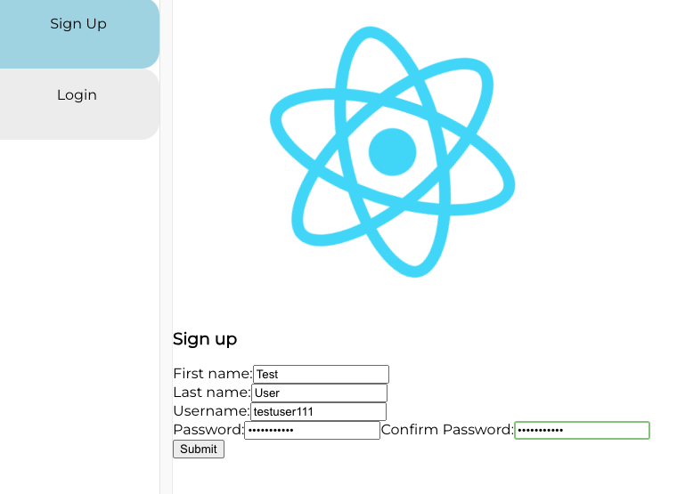
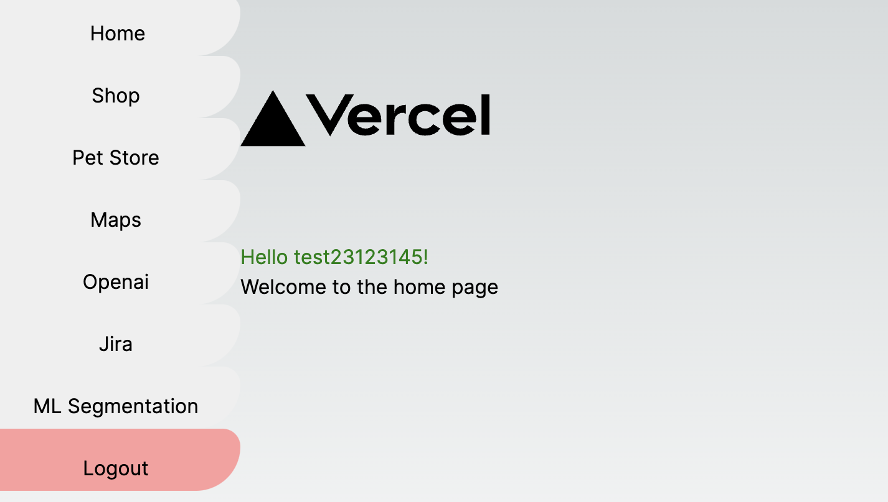
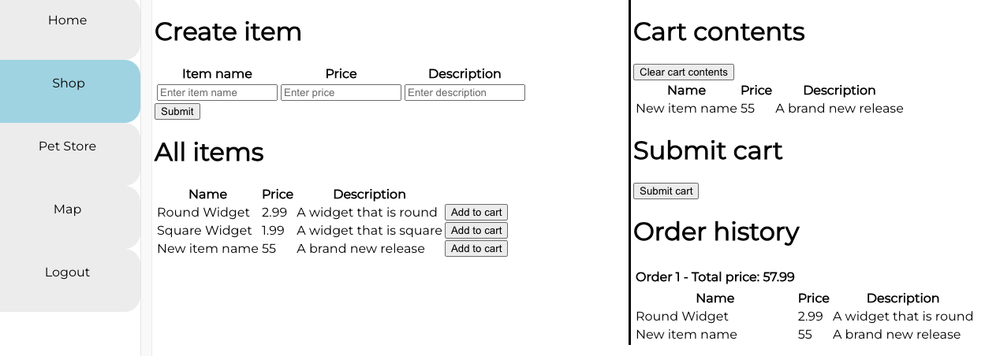
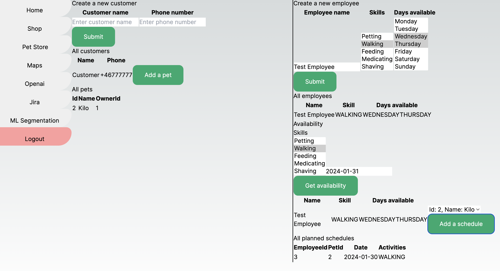
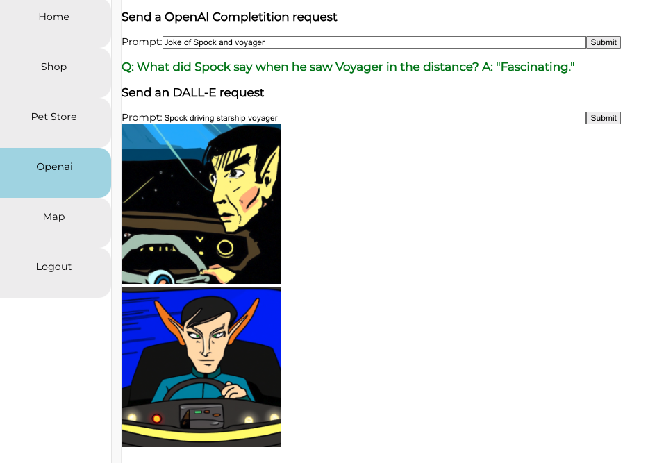
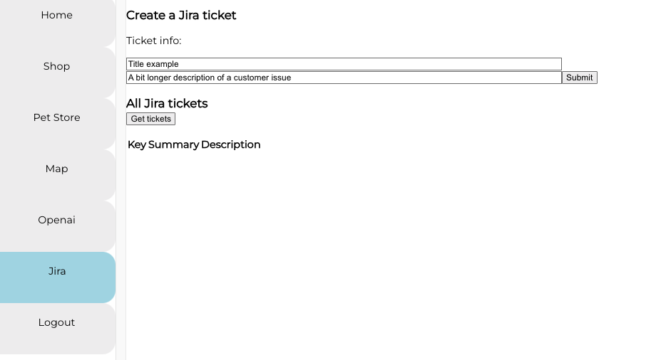
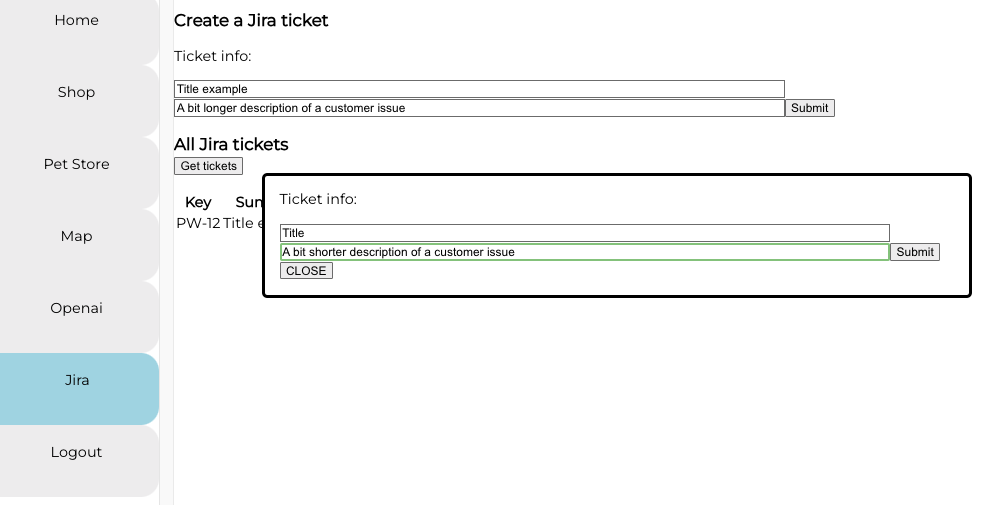
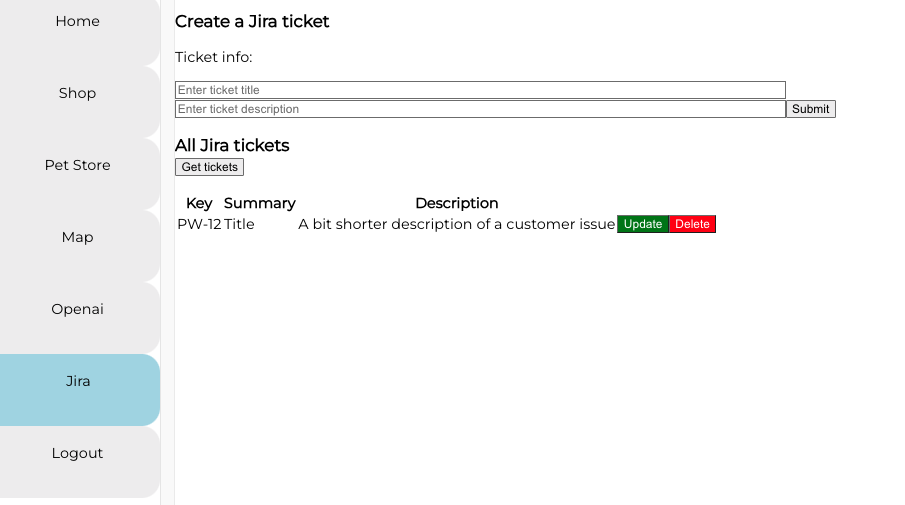

# Web development portfolio

This is a collection of my development projects from Web Development and Predictive Analytics Nanodegrees:
- Back-end [API services](#required-api-services) developed by me during my Nanodegree [Web Development at Udacity](https://www.udacity.com/course/java-developer-nanodegree--nd035).
- React front-end [interface](#react-front-end) for utilizing these back-end services from above and new services below.
- ML pipeline for [Dynamic Customer Segmentation](#1-machine-learning-system-for-customer-segmentation), building on my Nanodegree in [Predictive Analytics for Business](https://www.udacity.com/course/predictive-analytics-for-business-nanodegree--nd008t)
- External api service integration, such as:
  - [OpenAI API](#5-openai)
  - [Google Maps API](#4-google-maps-api-key-how-to-get)
  - [Jira API with an internal proxy API service to avoid CORS](#6-jira)
- [Logging with log4j](ecommerce/README.md#logging-with-slf4j-and-log4j) and [CI/CD with Jenkins](ecommerce/README.md#cicd-with-jenkins)

Example view with ML pipeline and other tabs:


## Certificates
[Predictive Analytics for Business Nanodegree certficiate](https://confirm.udacity.com/e/3ac984b2-6128-11ee-a6fe-9be76f9bc811)

[Web Development Nanodegree certficiate](https://graduation.udacity.com/confirm/QDDKHJF9)

## REACT front-end

Install packages and start React front-end from root of react-apiview-app:

```bash
npm install
npm start
```

Runs the app in the development mode.\
Open http://localhost:5001 to view it in your browser.

The page will reload when you make changes.\
You may also see any lint errors in the console.

If everything is correctly started, you should see a login page:


And you should be able to register and log in, [after starting the backend services, ecommerce is a must, the rest is optional](#2-ecommerce-api), and see the current front-end of the api integrations from the services above:


## 1. Machine learning system for Customer Segmentation
  
MLOps interface for [Customer Segmentation API](ml-pipeline/README.md), the user is able to:
- Add new customer data point to the database.
- Sample reference database with user specified samples.
- Sample reference database with predefined 10-20-50-100-200 amount of samples.
   All these steps will retrigger the segmentation process and then the pictures and tables will update with the new results.

View results:
- Pictures: correlation between parameters and the different segments
- Table: current db from postgres.


## 2. Shop interface for [eCommerce web store REST API](ecommerce/README.md), 

The user is able to:
- Create new items.
- Add existing items to the cart.
- See and clear the cart.
- Submit cart and check order history.
  

## 3. Pet Store interface for the [Pet Store's REST API](petstore/README.md)

The user is able to:
- Add new customer.
- Add a new Pet to existing customers.
- Add new employees with skills and schedules.
- Check availability based on skills and schedules.
- Plan a new schedule for an employee and assign it to a pet.


## 4.  GoogleMaps

Map interface for integrating Google Maps API with the [Vehicle location service's REST API](vehicles-api/README.md).
The user is able to:
- Click on the map to add new vehicle locations.
- Click on existing locations and check basic info and delete the location.
  

## 5. OpenAI

OpenAI interface for communicating with
the [OpenAI API](https://platform.openai.com/docs/api-reference), the user is able to:
- Send a prompt and receive a Completion.
- Send a prompt and receive two DallE image response.
  

## 6. Jira
Jira interface for communicating with
the [Jira API](https://platform.openai.com/docs/api-reference), to use it:
- [Register](https://www.atlassian.com/software/jira/free)
- [Create Personal Access Token](https://confluence.atlassian.com/enterprise/using-personal-access-tokens-1026032365.html)
- [Use it for requests](https://developer.atlassian.com/cloud/jira/platform/basic-auth-for-rest-apis/)

The user is able to:

- Create a new Jira ticket
  
- List existing tickets and delete them
  
- Update existing tickets
  
- See updated values
  


# Required api services

In the repository start these 3 backend services in different terminals

## 1. MLOps api:

1- Setup postgres db
Install postgres and start it
```bash
brew install postgresql@15
brew services start postgresql@15
echo 'export PATH=/opt/homebrew/opt/postgresql@15/bin/postgres:$PATH  ' >> ~/.zshrc
psql postgres
```

Create segmentationdb

```sql
CREATE DATABASE segmentationdb;
CREATE USER segmentmaster WITH PASSWORD 'segment';
GRANT ALL ON DATABASE segmentationdb TO segmentmaster;
ALTER DATABASE segmentationdb OWNER TO segmentmaster;
GRANT ALL PRIVILEGES ON DATABASE segmentationdb TO segmentmaster;
\c riskdb segmentmaster
GRANT ALL ON SCHEMA public TO segmentmaster;
exit
```

2- Run init_segmentationdb and Flask App in one terminal, run the rest of the steps in another terminal
```bash
virtualenv venv
source venv/bin/active
pip3 install -r requirements.txt
cd src
python3 init_segmentationdb.py
python3 app.py
```

## 2. eCommerce api:

```
cd ecommerce
mvn clean package
java -jar target/ecommerce-0.0.1-SNAPSHOT.jar
```

## 3. Vehicles api and boogle-maps:

```
cd vehicles-api
mvn clean package
java -jar target/vehicles-api-0.0.1-SNAPSHOT.jar
```
```
cd boogle-maps
mvn clean package
$ java -jar target/boogle-maps-0.0.1-SNAPSHOT.jar
```

## 4. Pet Store api:

```
Install msql, eg. on mac:
brew install mysql
brew services start mysql

Start mysql and flush privileges, if issues arise:
mysql -u root    
FLUSH PRIVILEGES;
ALTER USER 'root'@'localhost' IDENTIFIED BY ‘root’;

start the service from repo root:
cd petstore
mvn clean package
java -jar target/petstore-0.0.1-SNAPSHOT.jar
```

## 4. Google Maps API key, [how to get](https://developers.google.com/maps/documentation/embed/get-api-key):

```
To be stored in the .env file in the root directory in this format:
REACT_APP_GMAPS_API_KEY=xxxxxxxxxxxxxx
```

## 5. OpenAI API key:

```
To be stored in the .env file in the root directory in this format:
REACT_APP_OPENAI_KEY==xxxxxxxxxxxxxx
```
## 6. Jira API key, [how to register](https://www.atlassian.com/software/jira/free) and [how to get an API key](https://support.atlassian.com/atlassian-account/docs/manage-api-tokens-for-your-atlassian-account/)

```
To be stored in the .env file in the root directory in this format:
REACT_APP_JIRA_KEY=XXXXXXXXXX
Together with your requested domain name
REACT_APP_JIRA_DOMAIN="https:/XXXXX.atlassian.net"
```
## 7. Web-proxy
Start [Web Proxy API](web-proxy/README.md) to avoid CORS issue with Jira [background](https://jira.atlassian.com/browse/JRASERVER-59101?focusedCommentId=2406855&page=com.atlassian.jira.plugin.system.issuetabpanels%3Acomment-tabpanel#comment-2406855)
```
mvn clean package
java -jar target/web-proxy-0.0.1-SNAPSHOT.jar
```

## 8. Eureka
Microservice registration and discovery, background: https://www.baeldung.com/spring-cloud-netflix-eureka
```
mvn clean package
java -jar target\eureka-0.0.1-SNAPSHOT.jar
```

The server runs on http://localhost:8761, at the default interface other services from above can be observed:


