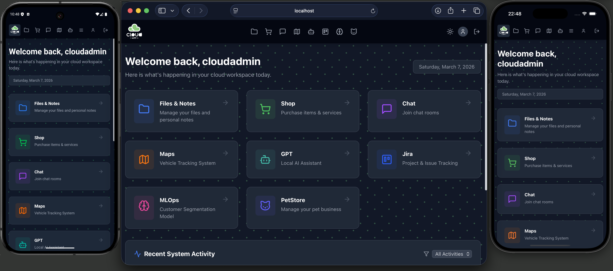
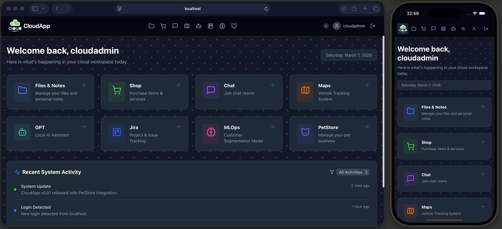
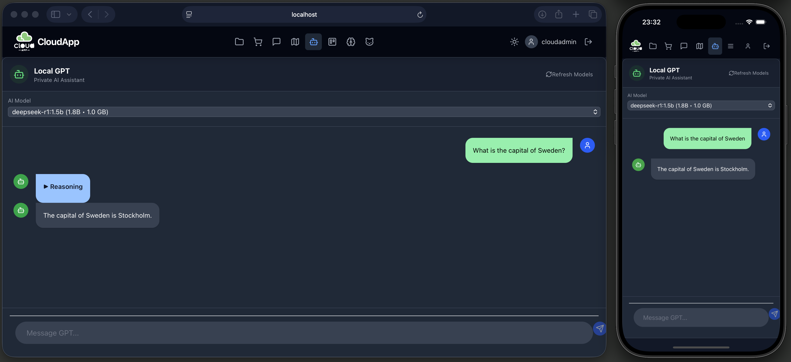
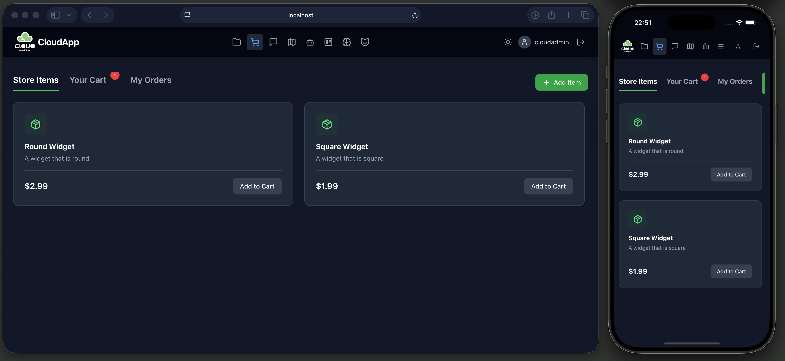
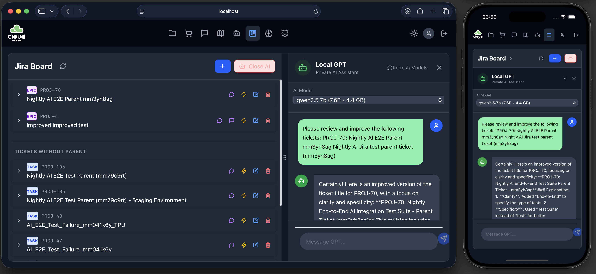
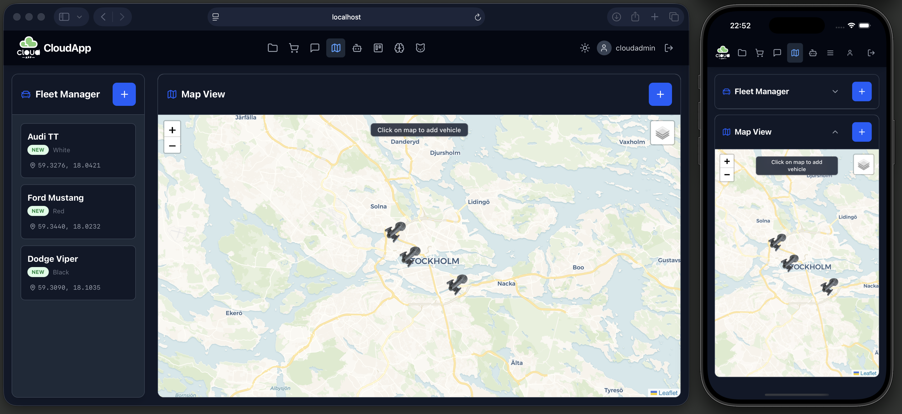
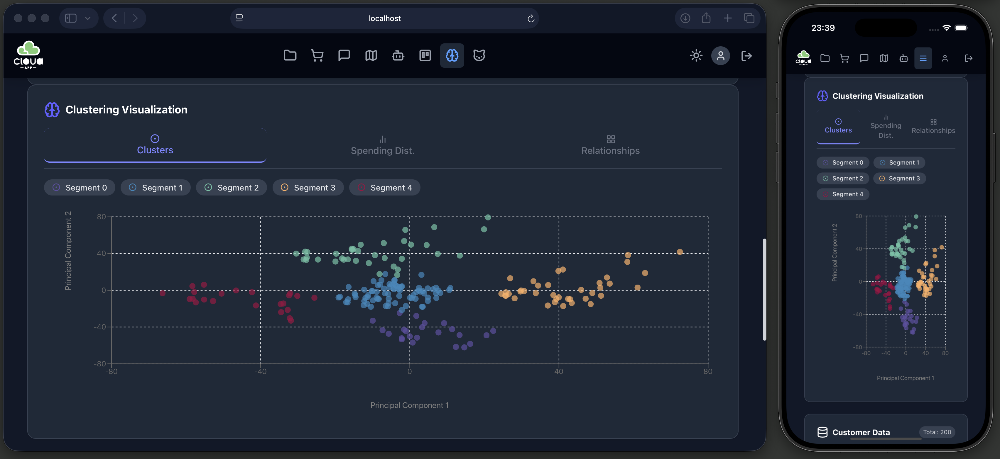
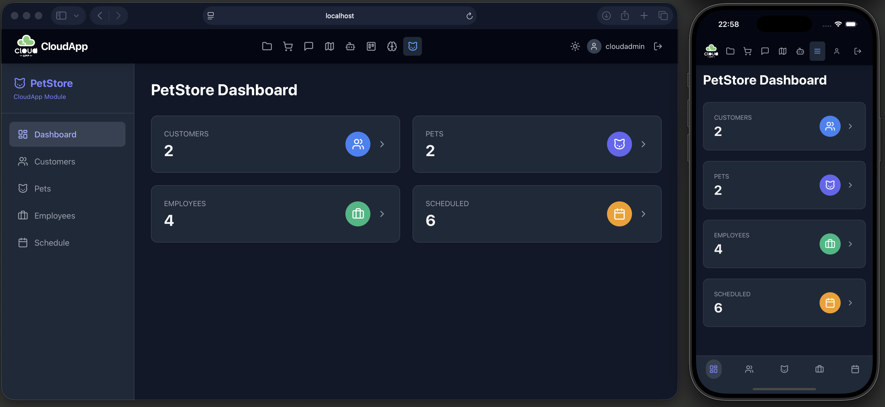
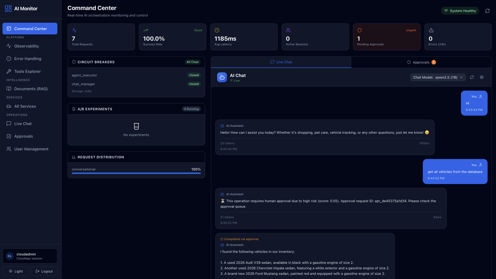

# CloudApp - Portfolio Web Platform

[](https://github.com/cjakabos/portfolio-web/actions/workflows/ci-tests.yml)
[](https://github.com/cjakabos/portfolio-web/actions/workflows/nightly-ai-integrations.yml)
[](./LICENSE)
[](https://github.com/cjakabos/portfolio-web/stargazers)
[](https://github.com/cjakabos/portfolio-web/network/members)

<p align="center">
  
</p>

Welcome to my dynamic portfolio, showcasing cutting-edge projects from my [Web Development](https://graduation.udacity.com/confirm/QDDKHJF9), [RAG and Agentic AI](https://www.coursera.org/account/accomplishments/specialization/JMUHR8ZOHOOE?utm_source=link&utm_medium=certificate&utm_content=cert_image&utm_campaign=sharing_cta&utm_product=prof), [Digital Marketing, ](https://www.coursera.org/account/accomplishments/specialization/3R6GJ2Q8ZCV9) [Predictive Analytics for Business](https://confirm.udacity.com/e/3ac984b2-6128-11ee-a6fe-9be76f9bc811) Nanodegrees. This repository is packed with full-stack solutions, ranging from microservices to interactive front-end interfaces, llm and agentic solutions and robust data analytics models.

Example view of emulated Android app, browser view on PC and emulated iOS app:


## What You Can Try In 10 Minutes

## 1) Homepage

- Shared overview for regular and admin users, where regular users have access for private notes, files, shopping, chatting with other users, checking vehicle location on maps and chatting with LLM.
- For Admin type of users: Jira for internal ticket management, MLOps for customer segmentation and PetStore for schedule management.



## 2) Notes + Files

- User notes and file upload workflows



## 3) Shop

- Add items to cart
- Submit orders and inspect order history
- Create new items (admin only)



## 4) Real-Time Chat

- Create rooms or join other people's room by shared room code.




## 5) Maps with vehicle locations

- Regular user: view vehicle locations on OpenStreetMap.
- Admin user: Add/remove vehicles.


## 6) Local AI chat

- Discuss with local models directly from UI
- Optional chain-of-thought display for models that support it


## 7) Jira + AI Refinement

- Create/list/update/delete Jira tickets
- Refine ticket drafts and batch create child ticket proposals with local LLM




## 8) Machine learning system for Customer Segmentation

MLOps interface for [Customer Segmentation API](backend/ml-pipeline/README.md), the user is able to auto trigger the whole customer segmentation process and generate the latest segmentation plots with these options:
- Add new customer data point to the database.
- Sample reference database with predefined 10-20-50-100-200 amount of samples.

View results:
- Graphs: correlation between parameters and the different segments.
- Table: current list of customers from postgres db.



## 9) Petstore

- Customer + pet management
- Employee scheduling and availability checks



## 10) AI Orchestration Layer

Path: `ai-orchestration/ai-orchestration-layer/`

Capabilities include:
- LangGraph-based routing and workflow execution for the 1-9 services above
- RAG ingestion/query over ChromaDB
- Human-in-the-loop approval queue
- A/B experimentation lifecycle and metrics
- Resilience/circuit breaking with graceful fallback behavior

## 11) Admin AI Orchestration Monitor

Path: `ai-orchestration/ai-orchestration-monitor/`

Provides:
- Chat interface to talk with the services in 1-9
- Observability dashboard
- RAG dashboard
- Approval queue
- Agentic Tool explorer for the services in 1-9
- Error dashboard
- Service health dashboard
- Model selector and unified operator view




## Why This Repo Exists

This repository is built as a practical, end-to-end reference for people who want to study or reuse:
- Secure gateway-driven microservice architecture with Java and Python
- Scalable frontend composition with module federation  (Next.js 15 + React 19)
- AI-native product patterns (local LLM, agentic tools, RAG, approvals, streaming) for the microservices
- Jira and OpenMaps integration
- Android and iOS deployment with Capacitor
- Full observability, testable, containerized, CI-ready workflows

## Quick Start (Lean Mode)

### Prerequisites

- Docker Desktop (or Docker Engine + Compose)
- OpenSSL (`openssl`)
- At least 16 GB RAM and 45 GB (+5-30GB depending on Ollama setup, and another + 20GB if Xcode and iOS emulator installed on Mac) free disk recommended for full showcase mode


### 1) Create local env file abd enerate local JWT keys

```bash
./scripts/setup-env-jwt-keys.sh
```

### 2) Start infrastructure + app

This will start the app without Jira, Local LLM and AI orchestration Admin view
```bash
docker compose -f docker-compose-infrastructure.yml up -d postgres postgres-ml mysql mongo zookeeper broker
docker compose -f docker-compose-app.yml up -d
```

### 3) Open the app

- Main app: http://localhost:5001

Demo users:

```text
user: cloudadmin      pwd: cloudy
user: regularuser123  pwd: 456789
```

### 4) Optional: setup Ollama
<details>
<summary>See details for Mac</summary>

Install local ollama, for Apple Silicon computers, GPU acceleration is not available via Docker, thus one needs to run it outside of docker:
```bash
brew install ollama
# Get a few thinking AND tools model https://ollama.com/search?c=tools&c=thinking
ollama pull qwen3:1.7b
ollama pull deepseek-r1:1.5b
# Get an embedding model for RAG at ollama.com/search?c=embedding
ollama pull qwen3-embedding:4b
ollama serve
```
</details>

<details>
<summary>See details for Linux and Windows</summary>

Linux
```bash
curl -fsSL https://ollama.com/install.sh | sh
```
Windows:  
Download from https://ollama.com/download

Follow the other steps from the Mac section of how to pull and serve models
</details>


### 4) Optional: run the full app, including agentic tools and observability

```bash
docker compose -f docker-compose-infrastructure.yml up -d
docker compose -f docker-compose-app.yml up -d
```

- Admin AI orchestration: http://localhost:5010

### Optional: self-hosted product analytics with Umami

Set these in your root `.env` file:

```bash
UMAMI_DB_NAME=umami
UMAMI_DB_USER=umami
UMAMI_DB_PASSWORD=replace-me
UMAMI_APP_SECRET=replace-me-with-openssl-rand-hex-32
NEXT_PUBLIC_UMAMI_HOST_URL=http://localhost:3001
NEXT_PUBLIC_UMAMI_WEBSITE_ID=<website-id-from-umami-ui>
NEXT_PUBLIC_UMAMI_DOMAINS=localhost,127.0.0.1
```

Bootstrap the dedicated PostgreSQL database and start Umami:

```bash
make bootstrap-umami-db
docker compose -f docker-compose-infrastructure.yml up -d umami
```

Open http://localhost:3001

On a brand-new Umami database, the default sign-in is `admin` / `umami`. Change it immediately after the first login.

After you create the website entry in Umami, set `NEXT_PUBLIC_UMAMI_WEBSITE_ID` in your root `.env` and rebuild the shell app because the website ID is injected at build time.

Tracker defaults in the shell app:

- manual SPA pageviews
- browser DNT respected
- search params and hashes excluded
- `beforeSend` payload sanitization for URLs, referrers, and custom event data

Full setup, privacy rules, and the current event catalog live in [docs/umami-analytics.md](/Users/csaba/1_CODING/portfolio-web/docs/umami-analytics.md).

### 5) Optional: Jira functionality
<details>
<summary>See details</summary>

If Jira functionality is to be used, follow the instructions below:

## Jira API key, [how to register](https://www.atlassian.com/software/jira/free) and [how to get an API key](https://support.atlassian.com/atlassian-account/docs/manage-api-tokens-for-your-atlassian-account/)

NOTE: you need to rebuild jira docker once the changes are applied:
```bash
docker compose -f docker-compose-app.yml up -d --build --force-recreate --no-deps next-jira
```
Set these in your root `.env` file:

```bash
JIRA_DOMAIN='https://your-jira-instance.atlassian.net'
JIRA_API_TOKEN='your-api-token'
JIRA_PROJECT_KEY='yourjiraprojectkey'
JIRA_EMAIL='youremail'
```
Only `JIRA_PROJECT_KEY` is exposed to the browser. Credentials stay server-side in `jiraproxy`.

</details>

### 6) Optional: Build and emulate Android and iOS apps

```bash
bash run_android_local_build.sh
bash run_ios_local_build.sh
```


### 7) Optional: Testing

Run all suites in one command:

```bash
docker compose -f docker-compose.test.yml up --build --abort-on-container-exit test-all
```

### 8) Optional: Mobile HTTPS over local network (stable cert)
<details>
<summary>See details</summary>


Use this if you open the app from a phone/tablet on your Wi-Fi network.

1. Install mkcert once on your laptop:

```bash
brew install mkcert nss
mkcert -install
```

2. Generate a persistent LAN cert with SANs for your hostnames/IPs:

```bash
./scripts/generate-local-mobile-tls-cert.sh --force
```

If your phone uses a specific host/IP not auto-detected, include it explicitly:

```bash
./scripts/generate-local-mobile-tls-cert.sh --force --hosts "192.168.1.42,my-mac.local"
```

3. Start app stack with mobile override:

```bash
docker compose -f docker-compose-infrastructure.yml up -d postgres postgres-ml mysql mongo zookeeper broker
docker compose -f docker-compose-app.yml -f docker-compose.mobile.yml up -d
```

4. Install/trust CA on phone from `secrets/tls/rootCA.pem`:

- iOS:
  - Open/install profile from `rootCA.pem`
  - Enable trust: `Settings > General > About > Certificate Trust Settings`
- Android:
  - Install CA certificate from file in security settings
  - Use browser apps that trust user-installed CAs for local dev

Then open `https://<your-laptop-lan-ip>` on the phone.
</details>

## Documentation

<details>
<summary>Repository map</summary>

| Area | Path | Purpose |
|---|---|---|
| App shell + MFE host | `frontend/cloudapp-shell/` | Main Next.js application |
| Micro frontends | `frontend/remote/` | Independent frontend modules |
| Java microservices | `backend/` | CloudApp, Petstore, Vehicles, Web Proxy |
| AI orchestration | `ai-orchestration/ai-orchestration-layer/` | FastAPI orchestration + RAG + HITL |
| AI admin monitor | `ai-orchestration/ai-orchestration-monitor/` | React/Vite operator console |
| Test suites | `tests/`, `e2e/` | Python, Java, gateway, E2E coverage |

</details>

<details>
<summary>System architecture and platform design</summary>

## System Overview

The platform is composed of:
- Next.js micro frontend shell + remotes
- Spring Boot and Flask/FastAPI microservices
- NGINX gateway as the sole ingress point
- Optional local LLM provider (Ollama)
- Central observability stack (Jaeger, Prometheus, Grafana)

## Security Model

- JWT session auth with RSA keypair
- Browser auth with HttpOnly `CLOUDAPP_AUTH` cookie
- CSRF protections for browser-driven state changes
- Role-based access (ADMIN/USER)
- Service-to-service auth token (`X-Internal-Auth`)
- Gateway enforces route-level authorization and rate limits
- Non-root runtime for frontend and AI services

## NGINX Gateway Responsibilities

- Auth subrequests against CloudApp
- Admin-only route enforcement for `/cloudapp-admin/*` and `/ai/system/*`
- Authenticated access requirements for `/ai/*` and `/ai/ws/*`
- WebSocket proxying
- API versioning rewrite (`/v1/` prefix)
- Header propagation (`traceparent`, `tracestate`, request IDs)

### Local TLS Modes

- Default local mode: image-generated self-signed TLS cert for `localhost`.
- Mobile LAN mode: `docker-compose.mobile.yml` mounts stable `mkcert` cert/key from `secrets/tls/` so phones can trust a persistent local CA.

## AI Orchestration Layer

Path: `ai-orchestration/ai-orchestration-layer/`

Key components:
- LangGraph orchestration state machine
- Capability routing (chat, tools, workflow, ML, RAG) for backend endpoints
- Checkpointing and memory fallback behavior
- HITL approval workflows with queue/state transitions
- A/B testing module with deterministic assignment + metrics
- WebSocket token streaming for interactive UX

## Observability

- Jaeger: distributed traces (`http://localhost:16686`)
- Prometheus: metrics scraping and retention (`http://localhost:9090`)
- Grafana: dashboards and alerting views (`http://localhost:3000`)
- OpenTelemetry instrumentation in Java and Python services

## Resilience

- Resilience4j circuit breakers in vehicles API integrations
- Redis-backed circuit breaking and fallback in AI orchestration
- Degraded-mode operation when optional dependencies are unavailable

## API Contract Governance

- OpenAPI snapshot export from running services
- CI drift detection against committed snapshots
- TypeScript client generation for frontend consumers

Relevant script:
- `scripts/contracts/openapi_contracts.py`

## Data Layer

| Database | Purpose |
|---|---|
| PostgreSQL (`postgres`) | CloudApp domain data |
| PostgreSQL (`postgres-ml`) | ML segmentation data |
| MySQL | Petstore domain data |
| MongoDB | Chat persistence |
| MongoDB (AB test) | Experiment metrics |
| Redis | AI state/caches/circuit breakers |
| ChromaDB | RAG embeddings/vector search |

## CI/CD

Workflows:
- `.github/workflows/ci-tests.yml`
- `.github/workflows/nightly-ai-integrations.yml`

CI covers backend, ML, gateway, contract checks, frontend unit tests, E2E, and AI monitor checks.

</details>

<details>
<summary>API docs</summary>

API docs (when stack is running):
- `http://localhost:80/cloudapp/swagger-ui/index.html#/item-controller`
- `http://localhost:80/cloudapp/swagger-ui/index.html#/cart-controller`
- `http://localhost:80/cloudapp/swagger-ui/index.html#/order-controller`

Vehicles API docs:
- `http://localhost:80/vehicles/swagger-ui.html`
</details>


<details>
<summary>Mobile Packaging for Android and iOS (Capacitor)</summary>

This repo includes Android/iOS Capacitor wrappers and local smoke orchestration for `frontend/cloudapp-shell`.

### Mobile prerequisites

- Docker Desktop
- Node.js + npm
- Android SDK tools in PATH (`adb`, `emulator`)
- Java 21 (Android Gradle builds)
- Xcode + Command Line Tools + iOS Simulator (macOS)
- CocoaPods locally (`brew install cocoapods`) or Docker (default script mode runs CocoaPods in Docker)
- Maestro CLI (`curl -Ls https://get.maestro.mobile.dev | bash`)

### One-time setup

```bash
cd frontend/cloudapp-shell
npm install
npm run mobile:doctor
npm run mobile:add:android
npm run mobile:add:ios
```

### Android local build + launch

```bash
# Docker-first web build + cap sync + debug APK + install + launch
bash run_android_local_build.sh

# Use local npm/node for web build + cap sync
ANDROID_NODE_MODE=local bash run_android_local_build.sh

# Run Maestro smoke after app install/launch
ANDROID_RUN_MAESTRO_SMOKE=1 bash run_android_local_build.sh

# Force bundled mode (hosted mode is default)
ANDROID_CAP_SERVER_URL="" bash run_android_local_build.sh
```

Android bootstrap behavior (`ANDROID_BOOTSTRAP_MODE`):

- `auto` (default): install missing Android/JDK tooling automatically when possible; fallback to manual commands only when automation cannot proceed
- `prompt`: ask before each install/create action
- `manual`: never install anything automatically; print exact manual commands and exit on missing prerequisites

### iOS local build + launch

```bash
# Docker-first by default (avoids local npm installs):
# web build + cap copy iOS + pod install + xcodebuild + simulator install/launch
bash run_ios_local_build.sh

# Force local npm/node mode
IOS_NODE_MODE=local bash run_ios_local_build.sh

# Force Dockerized CocoaPods (avoids local CocoaPods install)
IOS_POD_MODE=docker bash run_ios_local_build.sh

# Force bundled mode (hosted mode is default)
IOS_CAP_SERVER_URL="" bash run_ios_local_build.sh
```

`IOS_POD_MODE` options:

- `docker` (default if unset): run `pod install` in Docker (no local CocoaPods required)
- `local`: run `pod install` with local `pod`
- `auto`: prefer local `pod`, fallback to Docker if local `pod` is missing
- `skip`: skip `pod install` entirely

In `docker` mode, the script uses a dedicated `ios-pods` one-shot service from [`docker-compose.test.yml`](./docker-compose.test.yml) and falls back to direct `docker run` only if that service invocation fails.

Xcode bootstrap behavior:

- By default (`IOS_XCODE_AUTO_SETUP=1`), the script attempts to auto-switch `xcode-select` to full Xcode (`/Applications/Xcode.app/Contents/Developer`) and runs first-launch/license steps.
- Disable auto-switch with `IOS_XCODE_AUTO_SETUP=0` if you prefer fully manual Xcode management.

### Mobile smoke entrypoints

```bash
make test-mobile-smoke
make test-ios-smoke
make test-ios-smoke-xcode
make test-ios-smoke-simulator
make test-ios-smoke-all
```

### Project-specific mobile defaults

- Capacitor app id: `com.portfolio.cloudapp`
- Capacitor app name: `CloudApp`
- Android hosted mode default URL: `http://localhost:5001`
- Android API URL default: `http://localhost:8080/cloudapp` (adb reverse `8080 -> host 80`, because Android cannot reliably bind reversed port `80`)
- Android local build script also sets adb reverse for common remote/data ports by default: `5002`, `5003`, `5005`, `5006`, `5333`, `11434`
- Android Maestro flow file: `tests/e2e/mobile/maestro/android-smoke.yaml`

If you run hosted mode from `docker-compose-app.yml`, rebuild the shell + gateway so the shell bundle uses the Android-safe API base:

```bash
docker compose -f docker-compose-app.yml up -d --build next-nginx-jwt next-cloudapp-shell
```
</details>

<details>
<summary>Test strategy and commands</summary>

# Testing (Minimal)

## Strategy
- Default path: Docker-only.
- Main command runs all suites in order via `test-all`.
- CI uses the same compose-based flow.

## Run Modes
- `Lean mode`: core product work and most test/debug loops. Start only the core datastores plus the app stack.
- `Showcase mode`: full demos and AI/observability work. Start the full infrastructure stack and optionally the Ollama profile.

Lean mode:
```bash
docker compose -f docker-compose-infrastructure.yml up -d postgres postgres-ml mysql mongo zookeeper broker
docker compose -f docker-compose-app.yml up -d
```

Showcase mode:
```bash
docker compose --profile ollama -f docker-compose-infrastructure.yml up -d
docker compose -f docker-compose-app.yml up -d
```

## Full Run
```bash
cd /portfolio-web
docker compose -f docker-compose.test.yml up --build --abort-on-container-exit test-all
```

## Targeted Runs
```bash
SERVICE=test-e2e
docker compose -f docker-compose.test.yml up --build --abort-on-container-exit "$SERVICE"
```
- Common services: `test-backend`, `test-backend-petstore`, `test-backend-vehicles`, `test-backend-webproxy`, `test-ml-pipeline`, `test-ai-orchestration-layer`, `test-nginx-gateway`, `test-frontend-unit`, `test-e2e`.

## Nightly AI Integrations
- Workflow: `.github/workflows/nightly-ai-integrations.yml`
- Scope: ChatLLM (live Ollama), AI Monitor model selectors (`chat` / `rag` / `embedding`), Jira AI refine + child proposal flow with cleanup.
- Required models:
    - `qwen3:1.7b`
    - `qwen3-embedding:4b`
- Jira nightly spec auto-skips when Jira secrets are missing.

## Cleanup
```bash
docker compose -p portfolio_test_all -f docker-compose.test.yml down -v --remove-orphans
docker compose -f docker-compose.test.yml down -v --remove-orphans
```

## Optional (local UI debugging)
```bash
docker compose -f docker-compose.test.yml --profile host-ui up -d test-shell-host test-nginx-host
```

## Local Playwright (no Docker)
Prerequisite: app endpoints must already be running on `localhost:5001` and `localhost:80`.

```bash
# Option A: start normal app stack (recommended for local Playwright)
docker compose -f docker-compose-infrastructure.yml up -d
docker compose -f docker-compose-app.yml up -d
```

```bash
# Option B: start host-ui test stack
docker compose -f docker-compose.test.yml --profile host-ui up -d test-shell-host test-nginx-host
```

```bash
cd /portfolio-web
docker compose -f docker-compose.test.yml --profile host-ui down -v --remove-orphans
docker compose -f docker-compose.test.yml --profile host-ui up -d test-shell-host test-nginx-host
curl -sf http://localhost:5001 >/dev/null && echo shell-ok
curl -sf http://localhost:80/nginx_health >/dev/null && echo nginx-ok

cd /portfolio-web/frontend/cloudapp-shell
npm ci --include=dev
npm run playwright:install
npm run playwright:open:all
```

```bash
cd /Users/csaba/1_CODING/portfolio-web/frontend/cloudapp-shell
npm ci
npm run playwright:install
npm run playwright:open
# chromium only (recommended locally)
# optional full matrix: npm run playwright:open:all
# headless: npm run playwright:test
```
- Uses `http://localhost:5001` (frontend) and `http://localhost:80` (gateway) by default.
- Do not use `docker compose -f docker-compose.test.yml up -d` for this mode.
- `playwright:open:all` includes retries; transient browser crashes may show as flaky, not hard fail.

## Running With Existing `portfolio-web` Containers
- `docker-compose.test.yml` (default, no `host-ui`) is safe to run in parallel.
- Why: isolated project-scoped networks + no host ports for test DB/services.
- Can still clash on resources (CPU/RAM), causing slower/flakier tests.
- `host-ui` profile can clash on ports `80`, `5001`, `5005`.
- If those ports are already used, stop app stack first or do not use `host-ui`.

## Docker Debugging

Use the smallest Compose topology that answers the question:

- `docker-compose.test.yml`: isolated test stack
- `docker-compose-app.yml`: app stack
- `docker-compose-infrastructure.yml`: infra dependencies

### Core Commands

Build only what changed:

```bash
docker compose -f docker-compose.test.yml build test-shell test-e2e
docker compose -f docker-compose.test.yml build test-nginx test-cloudapp
docker compose -f docker-compose.test.yml build test-ai-monitor
```

Run one-off focused commands:

```bash
docker compose -f docker-compose.test.yml run --rm test-e2e e2e/auth.spec.ts --project=chromium
docker compose -f docker-compose.test.yml run --rm test-e2e e2e/monitor.spec.ts --project=chromium
docker compose -f docker-compose.test.yml run --rm test-e2e e2e/auth.spec.ts --grep "Logout"
```

Bring up dependencies for manual inspection:

```bash
docker compose -f docker-compose.test.yml up -d test-shell test-nginx test-ai-monitor
docker compose -f docker-compose-app.yml up -d
docker compose -f docker-compose-infrastructure.yml up -d
```

Inspect state:

```bash
docker compose -f docker-compose.test.yml ps
docker compose -f docker-compose-app.yml ps
docker ps --format "table {{.Names}}\t{{.Status}}"
docker ps -a --format "table {{.Names}}\t{{.Status}}"
```

Read logs:

```bash
docker compose -f docker-compose.test.yml logs test-nginx
docker compose -f docker-compose.test.yml logs test-shell
docker logs portfolio-web-test-e2e-1
docker logs next-nginx-jwt
```

### Recommended Flow

1. Rebuild only touched services.
2. Run one failing spec or one failing test container.
3. Check container logs before changing code again.
4. Widen to a small subset once the first failure is fixed.
5. Run the full suite only after the subset is green.
6. Reset with `down -v --remove-orphans` only when you suspect stale volumes or orphaned containers.

### Good Patterns

For gateway or contract failures:

```bash
docker compose -f docker-compose.test.yml up --build --abort-on-container-exit test-nginx-gateway
docker compose -f docker-compose.test.yml up --build --abort-on-container-exit test-api-contracts
```

For E2E failures:

```bash
docker compose -f docker-compose.test.yml build test-shell test-e2e
docker compose -f docker-compose.test.yml run --rm test-e2e e2e/auth.spec.ts --project=webkit
docker compose -f docker-compose.test.yml run --rm test-e2e e2e/shop.spec.ts '--project=firefox' --grep 'should create a real item and add it to cart without request stubs'
docker compose -f docker-compose.test.yml run --rm test-e2e e2e/auth.spec.ts e2e/monitor.spec.ts --grep "admin|logout"
```

For AI and monitor failures:

```bash
docker compose -f docker-compose.test.yml build test-ai-monitor test-e2e
docker compose -f docker-compose.test.yml up -d test-ai-monitor test-nginx test-shell
docker compose -f docker-compose.test.yml logs test-ai-monitor
```

For app readiness:

```bash
docker compose -f docker-compose-app.yml up -d
docker compose -f docker-compose-app.yml ps
docker compose -f docker-compose-infrastructure.yml ps --all
```

### Common Failure Patterns

- Rebuilding everything when only one frontend changed.
- Running full E2E before reproducing a single failing spec.
- Forgetting that test builds can bake env vars into the frontend at build time.
- Debugging backend auth without checking gateway routing and `auth_request` behavior.
- Assuming container health means route readiness. In this repo, gateway behavior can still be wrong while all services are healthy.

### Platform-Specific Lockfiles

- macOS-generated `package-lock.json` files can miss Linux-native packages needed by Docker builds.
- For the Next.js remotes and shell, validate lockfiles before pushing:

```bash
python3 scripts/check_frontend_native_lockfiles.py
```

- This check guards the `Dockerfile_FE` services against missing Linux SWC and Tailwind oxide entries.
- The AI monitor uses a separate Dockerfile fallback for Rollup native bindings. Keep that fallback in place unless the monitor lockfile becomes reliably multi-platform in CI and nightly container builds.

</details>

<details>
<summary>Backend service docs</summary>

  - [backend/cloudapp/README.md](./backend/cloudapp/README.md)
  - [backend/petstore/README.md](./backend/petstore/README.md)
  - [backend/vehicles-api/README.md](./backend/vehicles-api/README.md)
  - [backend/web-proxy/README.md](./backend/web-proxy/README.md)
</details>

## Contributing

- Read [CONTRIBUTING.md](./CONTRIBUTING.md)
- Report bugs or request features through GitHub Issues
- Use [SECURITY.md](./SECURITY.md) for vulnerability reporting


## License

MIT, see [LICENSE](./LICENSE).
