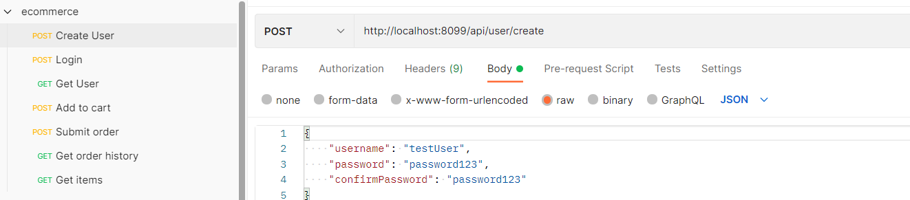
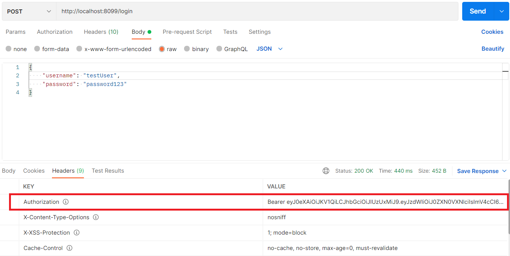
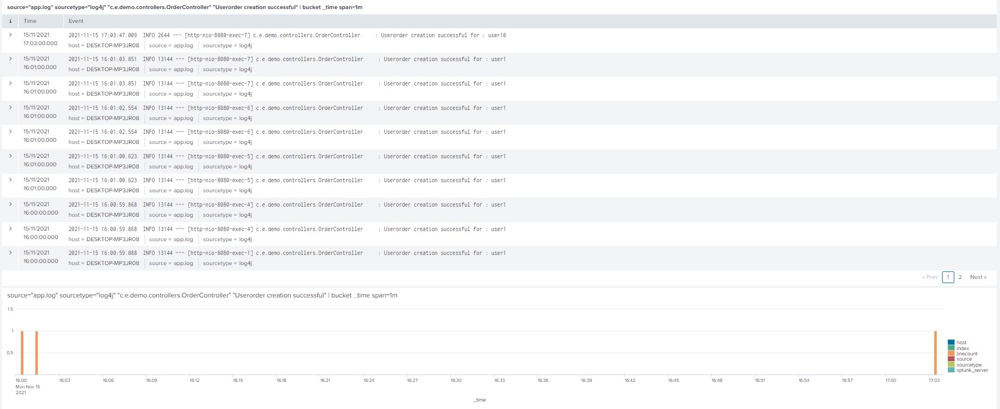
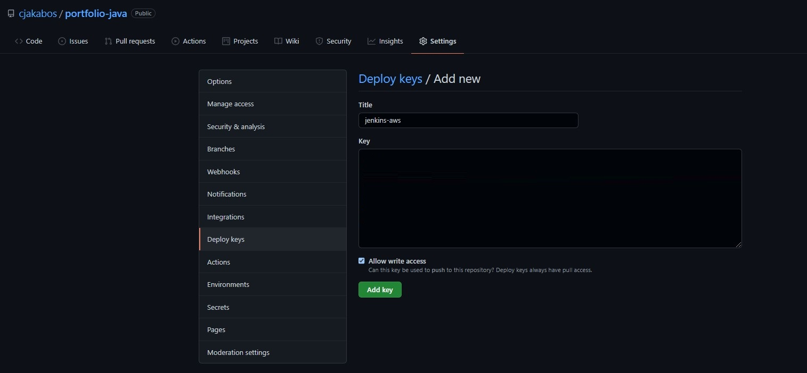

# Cloudapp Application

This is the final project to demonstrate the security and DevOps skills that I learned in the last part of the program.
The goal was to setup an cloudapp app with the following requirements:

* handle different HTTP requests to manipulate the cloudapp postgres database
* a proper authentication and authorization controls so users can only access their data, and that data can only be
  accessed in a secure way
* the testing should reach at least 80% Coverage
* proper logging with Splunk boards should be implemented
* the repo should be able to deploy and build in a Jenkins environment

## Project setup

In the project there are 6 packages:

* demo - this package contains the main method which runs the application

* model.persistence - this package contains the data models that Hibernate persists to H2. At the application “demo”
  class, there is `@EntityScan` annotation, telling Spring that this package contains our data models. There are 4
  models:
    * Cart for holding a User's items
    * Item for defining new items
    * User to hold user account information
    * UserOrder to hold information about submitted orders.

* model.persistence.repositories - these contain a `JpaRepository` interface for each of the models. This allows
  Hibernate to connect them with the database, so the data can be accessed from the code, as well as define certain
  convenience methods. At the application “demo” class, there is a  `@EnableJpaRepositories` annotation, telling Spring
  that this package contains our data repositories.

* model.requests - this package contains the request models. The request models are transformed by Jackson from JSON to
  these models as requests are made. Note the `Json` annotations, telling Jackson to include and ignore certain fields
  of the requests. These annotations can be seen on the models themselves.

* controllers - these contain the api endpoints for the app, one per model. They all have the `@RestController`
  annotation to allow Spring to understand that they are a part of a REST API.

* security - see "Adding Authentication and Authorization" secion below

In resources, there is the application configuration that sets up the database and Hibernate. It also contains a
data.sql file with a couple of items to populate the database with. Spring runs this file every time the application
starts.

## Adding Authentication and Authorization

Proper authentication and authorization controls is used so users can only access their data, and that data can only be
accessed in a secure way. It is done using a combination of usernames and passwords for authentication, as well as JSON
Web Tokens (JWT) to handle the authorization.

For password encryption the project uses bCrypt: it is based on the Blowfish cipher algorithm. It has a crucial phase
for key setup. This phase starts with encrypting a sub-key and uses the output of this encryption to change another
sub-key. This way, the bCrypt involves iterative steps for generating the hash, making it a preferred choice for
critical applications.

The remaining implementation:

1. Added spring security dependencies: Spring-boot-starter-security
2. Added java-jwt dependency, as JWT does not ship as a part of spring security.
3. Password property for the user class.
4. Spring Boot ships with an automatically configured security module that must be disabled, as we need our own
   implementation:
    * a subclass of `UsernamePasswordAuthenticationFilter` for taking the username and password from a login request and
      logging in. This, upon successful authentication, hands back a valid JWT in the `Authorization` header.
    * a subclass of `BasicAuthenticationFilter`.
    * an implementation of the `UserDetailsService` interface. This takes a username and returns user instance with the
      user's username and hashed password. a subclass of `WebSecurityConfigurerAdapter`. This attaches the user details
      service implementation to Spring's `AuthenticationManager`. It also handles session management and what endpoints
      are secured. For this project one manage the session so session management is disabled. The filters are added to
      the authentication chain and every endpoint but one should have security required. The one that should not is the
      one responsible for creating new users.

## Usage

Once started, using a REST client, such as
Postman [(file included here)](src/main/resources/cloudapp.postman_collection.json), explore the APIs.  
Creating a user:

Login with that user, copy Bearer token from response header:

All remaining requests should use that Bearer token as here:

## Testing

The unit tests for the controllers has 81% coverage.

## Logging with SLF4J and Log4j

Simple Logging Facade for Java (SLF4J) is an API that can be used as an abstraction layer for several logging
frameworks. Examples include java.util.logging, logback and Log4j. It is one of the best practices to use SLF4J in
enterprise application development. SLF4J in combination with any logging framework provides a complete logging
solution.

All Controllers has different loggings created for successful/failed task, one can setup a Splunk dashboard or alert for
these, here are some examples:

User creation per minute statistics:

Order creation per minute statistics:

Order failure alert:

## CI/CD with Jenkins

At the Jenkins instance add a new Freestyle project:

Add public key to GitHub repo's deploy keys:

Add GitHub link to Jenkins:

Set build goal to "package" and point to the POM file of the project:

Successful build from the GitHub repo:

