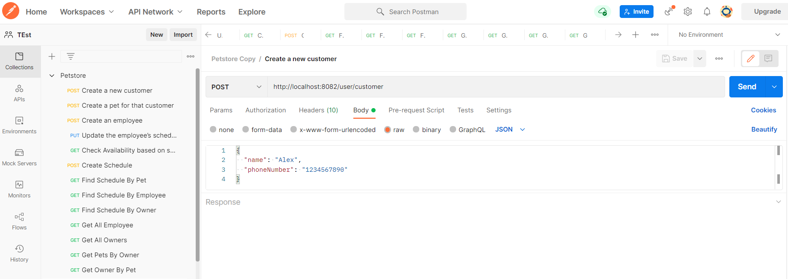

# Petstore project

Petstore a Software as a Service application that provides a scheduling interface for a small business that takes care
of animals. This Spring Boot project will allow users to create pets, owners, and employees, and then schedule events
for employees to provide services for pets.

## Getting Started

### Dependencies

* [IntelliJ IDEA Community Edition](https://www.jetbrains.com/idea/download) (or Ultimate) recommended
* [Java SE Development Kit 8+](https://www.oracle.com/technetwork/java/javase/downloads/index.html)
* [Maven](https://maven.apache.org/download.cgi)
* [MySQL Server 8](https://dev.mysql.com/downloads/mysql/) (or another standalone SQL instance)
* [Postman](https://www.getpostman.com/downloads/)

Part of this project involves configuring a Spring application to connect to an external data source, which must be
installed before building the software. Here
are [instructions for installing MySQL 8](https://dev.mysql.com/doc/refman/8.0/en/installing.html).

Server and Connector/J is a must, but it is also convenient to install the Documentation and Workbench.

After installing the Server, you will need to create a schema and a user that your application will use to perform
operations on the server. The user should have permissions on localhost:

```
CREATE SCHEMA `petstore` ; -- Create the petstore database 
CREATE USER 'root'@'localhost' IDENTIFIED BY 'root'; -- Create the user if you haven’t yet 
ALTER USER 'root'@'localhost' IDENTIFIED BY 'root'; -- Make sure that the password is set
GRANT ALL ON petstore.* TO 'root'@'localhost'; -- Gives all privileges to the new user on petstore
```

### Installation

```
mvn clean package
java -jar target\petstore-0.0.1-SNAPSHOT.jar
```

You should see the message "Petstore Starter installed successfully" in your browser at http://localhost:8083/petstore/test

### Tested Conditions

The following tests are performed:

* `testCreateCustomer` - **UserController.saveCustomer** returns a saved customer matching the request
* `testCreateEmployee` - **UserController.saveEmployee** returns a saved employee matching the request
* `testAddPetsToCustomer` - **PetController.getPetsByOwner** returns a saved pet with the same id and name as the one
  saved with **UserController.savePet** for a given owner
* `testFindPetsByOwner` - **PetController.getPetsByOwner** returns all pets saved for that owner.
* `testFindOwnerByPet` - **UserController.getOwnerByPet** returns the saved owner used to create the pet.
* `testChangeEmployeeAvailability` - **UserController.getEmployee** returns an employee with the same availability as
  set for that employee by **UserControler.setAvailability**
* `testFindEmployeesByServiceAndTime` - **UserController.findEmployeesForService** returns all saved employees that have
  the requested availability and skills and none that do not
* `testSchedulePetsForServiceWithEmployee` - **ScheduleController.createSchedule** returns a saved schedule matching the
  requested activities, pets, employees, and date
* `testFindScheduleByEntities` - **ScheduleController.getScheduleForEmployee** returns all saved schedules containing
  that employee. **ScheduleController.getScheduleForPet** returns all saved schedules for that pet. **
  ScheduleController.getScheduleForCustomer** returns all saved schedules for any pets belonging to that owner.

### Postman

In addition to the included unit tests, a Postman collection has been provided.

1. Open Postman.
2. Select the `Import` button.
3. Import the file found in this repository under `src/main/resource/Petstore.postman_collection.json`
4. Expand the Petstore folder in postman.

Each entry in this collection contains information in its `Body` tab for test purposes. Example use-case, follow order:

1. Create a new customer.
2. Create a pet for that customer.
3. Create an employee.
4. Update the employee’s schedule.
5. Find out which employees with the right skills are available on a given date.
6. Schedule one or more employees to do a set of activities with one or more pets.
7. Look up currently scheduled events for an employee, a pet, or a customer.

**The postman interface**


## Built With

* [Spring Boot](https://spring.io/projects/spring-boot) - Framework providing dependency injection, web framework, data
  binding, resource management, transaction management, and more.
* [Google Guava](https://github.com/google/guava) - A set of core libraries used in this project for their collections
  utilities.
* [H2 Database Engine](https://www.h2database.com/html/main.html) - An in-memory database used in this project to run
  unit tests.
* [MySQL Connector/J](https://www.mysql.com/products/connector/) - JDBC Drivers to allow Java to connect to MySQL Server

## License

This project is licensed under the MIT License - see the [LICENSE.md]()