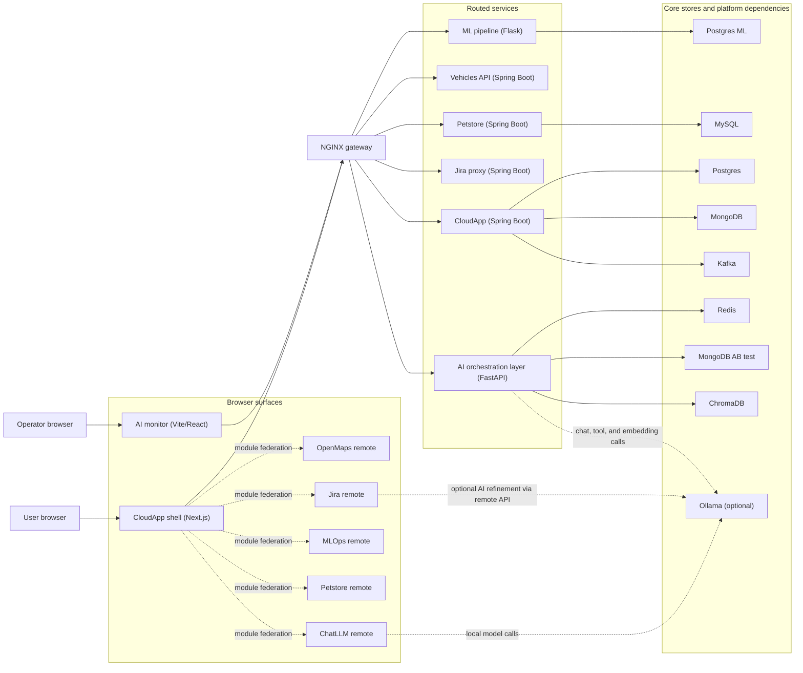
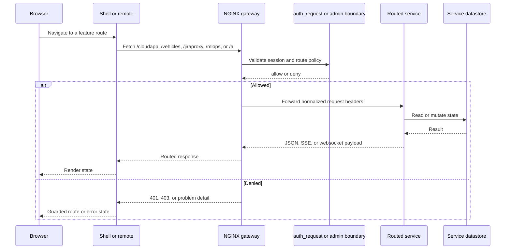
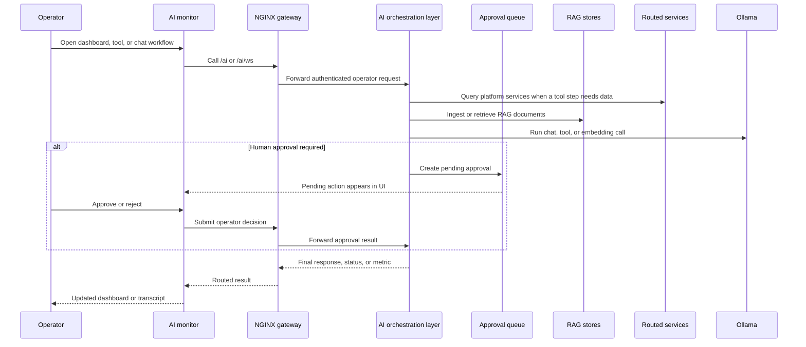

# Showcase Architecture

Use this document during the `Architect deep dive` and the `AI/operator tour`.
It keeps the flagship platform story grounded in a small set of diagrams rather
than expecting readers to reconstruct the shape from the source tree alone.

## 1. System Map

What this shows:

- the shell is the primary user entrypoint and loads breadth modules through
  module federation
- the gateway remains the policy boundary for both product and operator traffic
- the Jira integration is split: Jira CRUD goes through the gateway and
  `jiraproxy`, while the Jira remote owns its local Ollama-assisted AI features
- the AI layer is part of the platform spine, not an isolated side project

## 2. Gateway-Routed Request Flow

What this shows:

- browser clients should prefer routed gateway paths over direct service access
- admin and operator boundaries are enforced before UI state is rendered
- the same gateway posture covers ordinary CRUD, browser remotes, and AI flows

## 3. AI / Operator Flow

What this shows:

- the operator app uses the same gateway discipline as the product shell
- approvals and RAG are first-class flows, not bolted-on demos
- the orchestration layer can reach routed business services without the
  monitor needing direct service credentials

## How To Use These Diagrams

- Use the `System Map` when introducing the repo to an architect or reviewer.
- Use the `Gateway-Routed Request Flow` when explaining why the gateway matters
  even for local development and demos.
- Use the `AI / Operator Flow` when showing how approvals, model selection, and
  routed tools fit into the broader platform story.
